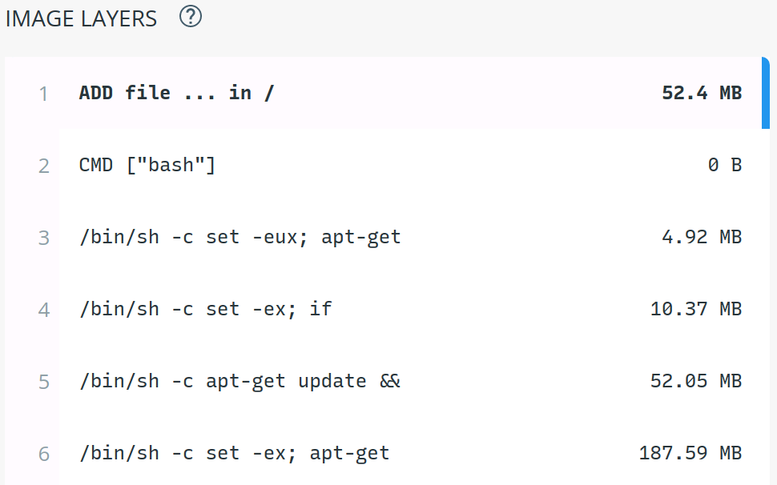

# Multiplatform Development and Application Containerization

<div class="right">[ Michal Koutenský &lt;koutenmi@fit.vutbr.cz&gt; ]

---

## Motivation

- Developer preference - not limited to Windows
- Reaching more users
- Single/familiar technology
- Sharing code between platforms

---

## .NET Architecture


---

## .NET Implementations

- .NET Framework (Windows)
- Mono (Multiplatform)
- Xamarin (Mobile)
- UWP (Windows Apps)
- .NET Core (Multiplatform)
- .NET (Multiplatform)

Different Standard Libraries → *.NET Standard*

---

## .NET Standard

- Attempt to unify various implementations
- Specification of API coverage
- *Interface* to program against
- Eliminates conditional compilation and recompilation

+++

https://dotnet.microsoft.com/en-us/platform/dotnet-standard#versions


---

## .NET Core / .NET 5+

- Unified cross-platform runtime
  - Operating Systems (Windows, MacOS, Linux) and Architectures (x86, x64, ARM)
- Open Source
  - Managed by Microsoft
  - [.NET Core GitHub](https://github.com/dotnet/core)
  - [.NET Core Libraries GitHub](https://github.com/dotnet/runtime)

---

## Target Framework Monikers (TFM)

| Target                     | TFM            |
|----------------------------|----------------|
| .NET 6.0                   | net6.0         |
| .NET Standard 2.1          | netstandard2.1 |
| .NET Core                  | netcoreapp3.1  |
| .NET Framework 4.8         | net48          |
| Universal Windows Platform | uap10.0        |
| .NET 6.0 Android           | net6.0-android |

+++

```xml
<Project Sdk="Microsoft.NET.Sdk">

  <PropertyGroup>
    <TargetFramework>net6.0</TargetFramework>
  </PropertyGroup>

...

</Project>
```

+++

```xml
<Project Sdk="Microsoft.NET.Sdk">

  <PropertyGroup>
    <TargetFrameworks>net6.0;netstandard2.1</TargetFrameworks>
  </PropertyGroup>

...

</Project>
```

---

## Portability Analyzer

- Tool to check API compatibility
  - CLI tool
  - Visual Studio extension


---

## Multiplatform UI

- *Mono*
  - Multiplatform Windows Forms implementation
  - Subset of APIs

- *Xamarin.Forms*
  - Android, iOS, Windows

- *MAUI*
  - Evolution of *Xamarin.Forms*
  - Android, iOS, Windows, MacOS, Linux, Tizen
  - RC2

---

## Deployment

### Framework-dependent

- `dotnet publish`
- App & third-party libraries
- *Cross-platform* binary (.dll)
- *Platform-specific* executable
- `dotnet <file.dll>`
- Requires .NET to be installed
- .NET can be updated independently

+++

### Self-contained

- `dotnet publish -r <RID>` (linux-arm64)
- Bundled runtime & standard libraries
- *Platform-specific* executable
- Control .NET version
- Larger output

---

## Containers

Distribution and deployment technology

- Lightweight VMs
- Application only — no hardware, no kernel
- *Namespaces* — kernel feature
  - `man unshare`
  - `mount`, `UTS`, `IPC`, `network`, `PID`, `cgroup`, `user`, `time`
- Common image format
- Runtime

---

## Docker



+++

### Dockerfile

- Instructions to create an image
- Instructions create image layers

```dockerfile
FROM mcr.microsoft.com/dotnet/sdk:6.0
COPY . /app
WORKDIR /app
RUN dotnet publish
CMD bin/MyApp.exe
```

+++

```sh
$ docker build .

Uploading context 10240 bytes
Step 1/3 : FROM busybox
Pulling repository busybox
 ---> e9aa60c60128MB/2.284 MB (100%) endpoint: https://cdn-registry-1.docker.io/v1/
Step 2/3 : RUN ls -lh /
 ---> Running in 9c9e81692ae9
total 24
drwxr-xr-x    2 root     root        4.0K Mar 12  2013 bin
drwxr-xr-x    5 root     root        4.0K Oct 19 00:19 dev
…
 ---> b35f4035db3f
Step 3/3 : CMD echo Hello world
 ---> Running in 02071fceb21b
 ---> f52f38b7823e
Successfully built f52f38b7823e
Removing intermediate container 9c9e81692ae9
Removing intermediate container 02071fceb21b
```

+++

### Image

- Static data
- Can be named, tagged, shared
- Only changed layers are rebuilt — ordering matters

```sh
docker run --name hello f52f38b7823e
```
+++



+++

### Container

- Running instance
- Can have multiple instances of the same image
- Should be disposable, replacable
  - Data stored in volumes

```sh
$ docker ps

CONTAINER ID        IMAGE                        COMMAND                CREATED              STATUS              PORTS               NAMES
4c01db0b339c        ubuntu:12.04                 bash                   17 seconds ago       Up 16 seconds       3300-3310/tcp       webapp
d7886598dbe2        crosbymichael/redis:latest   /redis-server --dir    33 minutes ago       Up 33 minutes       6379/tcp            redis,webapp/db
```

- `docker start/stop`

+++

### Docker Compose

- Declarative configuration of containers
- Larger deployment unit (e.g. frontend + backend + db)

```docker-compose
services:
  frontend:
    image: frontend
    ports:
      - "80:8080"
    links:
      - backend
  backend:
    image: backend
    volumes:
      - data:/var/myapp/data
    links:
      - db
  db:
    image: postgres
    volumes:
      - db-data:/var/postgres/data
volumes:
  data: {}
  db-data: {}
```

- `docker compose up|down|status`

---

## Podman

- Drop-in replacement for Docker
- Daemonless, rootless
- REST API
- Kubernetes-compatible pods
  - All containers "sharing localhost" vs. Docker Compose

---

## Language Server Protocol

- Interface between language tools and editor plugins
- *m * n* → *m + n* integrations
- Language servers provide smart features and diagnostics
  - C/C++ (*ccls*)
  - C# (*omnisharp*)
  - LaTeX (*digestif*)
  - YAML (*yaml-language-server*)
  - Dockerfile (*dockerfile-language-server-nodejs*)
- Editor plugins (clients) provide integration
  - VSCode (*builtin*)
  - JetBrains IDEs (*intelij-lsp*)
  - NeoVim (*builtin*)
  - Emacs (*lsp-mode*)
