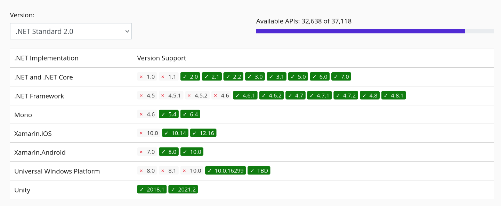
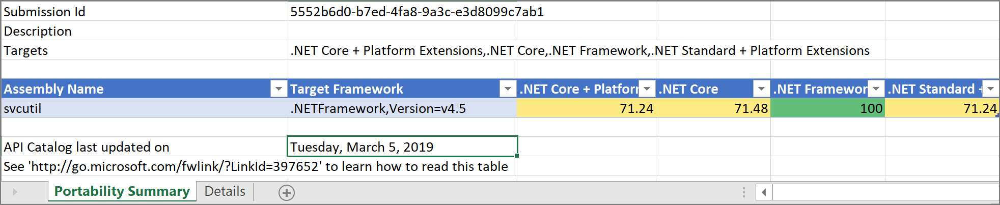

# Multiplatform Development and Application Containerization

<div class="right">[ Michal Koutenský &lt;koutenmi@fit.vutbr.cz&gt; ]

---

## Motivation

#### Multiplatform Development
- Developer preference - not limited to Windows
- Some tools are single-platform (or work better on some platforms)

#### Multiplatform Deployment
- Reaching more users
- Single/familiar technology
- Sharing code between platforms

---

## .NET Architecture



---

## .NET Implementations

- .NET Framework (Windows)
- Mono (Multiplatform)
- Xamarin (Mobile)
- UWP (Windows Apps)
- .NET Core (Multiplatform)
- .NET (Multiplatform)

Different Standard Libraries → *.NET Standard*

---

## .NET Standard

- Attempt to unify various implementations
- Specification of API coverage
- *Interface* to program against
- Eliminates conditional compilation and recompilation

+++

https://dotnet.microsoft.com/en-us/platform/dotnet-standard#versions



---

## .NET Core / .NET 5+

- Unified cross-platform runtime
  - Operating Systems (Windows, MacOS, Linux) and Architectures (x86, x64, ARM)
- Open Source
  - Managed by Microsoft
  - [.NET Core GitHub](https://github.com/dotnet/core)
  - [.NET Core Libraries GitHub](https://github.com/dotnet/runtime)

---

## Target Framework Monikers (TFM)

| Target                     | TFM            |
|----------------------------|----------------|
| .NET 6.0                   | net6.0         |
| .NET Standard 2.1          | netstandard2.1 |
| .NET Core                  | netcoreapp3.1  |
| .NET Framework 4.8         | net48          |
| Universal Windows Platform | uap10.0        |
| .NET 6.0 Android           | net6.0-android |

+++

```xml
<Project Sdk="Microsoft.NET.Sdk">

  <PropertyGroup>
    <TargetFramework>net6.0</TargetFramework>
  </PropertyGroup>

...

</Project>
```

+++

```xml
<Project Sdk="Microsoft.NET.Sdk">

  <PropertyGroup>
    <TargetFrameworks>net6.0;netstandard2.1</TargetFrameworks>
  </PropertyGroup>

...

</Project>
```

---

## Portability Analyzer

- Tool to check API compatibility
  - CLI tool
  - Visual Studio extension



---

## Multiplatform UI

- *Mono*
  - Multiplatform Windows Forms implementation
  - Subset of APIs

- *Xamarin.Forms*
  - Android, iOS, Windows

- *MAUI*
  - Evolution of *Xamarin.Forms*
  - Android, iOS, Windows, MacOS, Tizen

---

## Deployment

+++

### Runtime Identifiers (RID)

- Identify target platforms
- Used for platform-specific assets in NuGet packages
- A graph of values, the most specific match is used
- `[os].[version]-[architecture]-[additional qualifiers]`

+++

```c
    win7-x64    win7-x86
       |   \   /    |
       |   win7     |
       |     |      |
    win-x64  |  win-x86
          \  |  /
            win
             |
            any
```

+++

### Framework-dependent

- `dotnet publish`
- App & third-party libraries
- *Cross-platform* binary (.dll)
- *Platform-specific* executable
- `dotnet <file.dll>`
- Requires .NET to be installed
- .NET can be updated independently

+++

### Self-contained

- `dotnet publish -r <RID>`
- Bundled runtime & standard libraries
- *Platform-specific* executable
- Control .NET version
- Larger output

+++

### Trimming

- Removal of unused code
- Based on build time analysis
- Dynamic runtime behavior not caught during build time can cause issues

```
<PropertyGroup>
    <PublishTrimmed>true</PublishTrimmed>
</PropertyGroup>
```

---

## Containers

+++

Distribution and deployment technology

- Lightweight VMs
- Application only — no hardware, no kernel
- *Namespaces* — kernel feature
  - `man unshare`
  - `mount`, `UTS`, `IPC`, `network`, `PID`, `cgroup`, `user`, `time`
- Open Container Initiative - common set of specifications

+++

### Why Are Containers Useful?

- Software makes demands and assumptions about the environment in which it executes
- Dependencies on other software components
- Version compatibility
- Build-time variability
- Finding dependencies
- Non-software artifacts (e.g., configuration)
- Conflicting assumptions

=> Containers try to capture the necessary environment, isolate it and make it transferable

"It works on my PC" -> "Here's my PC"

+++



---

## Container Runtimes

- Low-level executor
- Consumes resources (mountpoints/configuration) from engines
- Interfaces with the kernel to spawn processes and set up namespaces

E.g., runc, crun, youkai, kata-containers

---

## Container Engines

- Handle user/API input
- Manage available images
- Prepare resources for runtime (root directory/configuration)
- Call the runtime

E.g., Docker, Podman, CRI-O

---

## Container Orchestrators

- Varied features
- Declarative definition of deployment units
- Dynamic deployment scheduling

E.g., Docker Compose, Docker Swarm, Kubernetes, Apache Mesos

---

## Container Images

- Layered data + metadata
- Each layer is its own archive
- Running an image means extracting all layers in order

+++

### Image Manifest

```json
{
  "schemaVersion": 2,
  "mediaType": "application/vnd.oci.image.manifest.v1+json",
  "config": {
    "mediaType": "application/vnd.oci.image.config.v1+json",
    "size": 7023,
    "digest": "sha256:b5b2b2c507a0944348e0303114d8d93aaaa081732b86451d9bce1f432a537bc7"
  },
  "layers": [
    {
      "mediaType": "application/vnd.oci.image.layer.v1.tar+gzip",
      "size": 32654,
      "digest": "sha256:9834876dcfb05cb167a5c24953eba58c4ac89b1adf57f28f2f9d09af107ee8f0"
    },
    {
      "mediaType": "application/vnd.oci.image.layer.v1.tar+gzip",
      "size": 73109,
      "digest": "sha256:ec4b8955958665577945c89419d1af06b5f7636b4ac3da7f12184802ad867736"
    }
  ]
}
```

---

## Building Images

- Dockerfile (Containerfile)
- BuilKit
- Buildah

+++

### Dockerfile

- Instructions to create an image
- Instructions create image layers

```dockerfile
FROM mcr.microsoft.com/dotnet/sdk:7.0
COPY . /app
WORKDIR /app
RUN dotnet publish
CMD bin/MyApp.exe
```

+++

### BuildKit

Advanced "Dockerfile" builder, uses intermediate language

- Dockerfile
- Buildpacks
- Mockerfile
- Gockerfile
- bldr (Pkgfile)
- HLB
- Earthfile (Earthly)
- Cargo Wharf (Rust)
- Nix
- mopy (Python)
- envd (starlark)
- Blubber
- Bass

+++

### Buildah

CLI for manipulating images

| Command                                              | Description                                                                                          |
| ---------------------------------------------------- | ---------------------------------------------------------------------------------------------------- |
| [buildah-add(1)](/docs/buildah-add.1.md)               | Add the contents of a file, URL, or a directory to the container.                                    |
| [buildah-build(1)](/docs/buildah-build.1.md)           | Build an image using instructions from Containerfiles or Dockerfiles.                                |
| [buildah-commit(1)](/docs/buildah-commit.1.md)         | Create an image from a working container.                                                            |
| [buildah-config(1)](/docs/buildah-config.1.md)         | Update image configuration settings.                                                                 |
| [buildah-copy(1)](/docs/buildah-copy.1.md)             | Copies the contents of a file, URL, or directory into a container's working directory.               |
| [buildah-mount(1)](/docs/buildah-mount.1.md)           | Mount the working container's root filesystem.                                                       |
| [buildah-run(1)](/docs/buildah-run.1.md)               | Run a command inside of the container.                                                               |
| [buildah-umount(1)](/docs/buildah-umount.1.md)         | Unmount a working container's root file system.                                                      |
| [buildah-unshare(1)](/docs/buildah-unshare.1.md)       | Launch a command in a user namespace with modified ID mappings.                                      |

---
