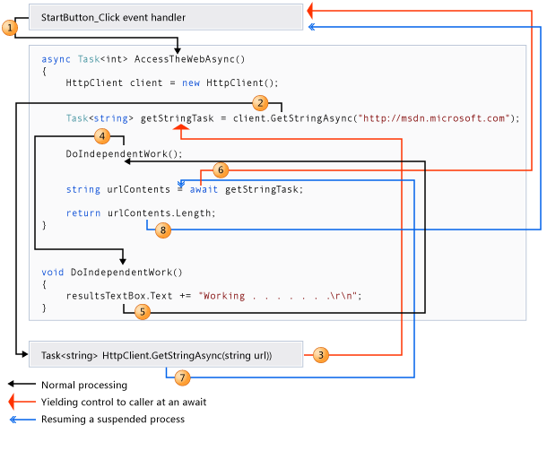

# Parallel programming
## Process, thread, and task from a .NET perspective

<div class="right">[ Jan Pluskal &lt;pluskal@vut.cz&gt;  ]</div>

---

## Lecture outline:  
1. Motivation
2. Parallel programming
3. Asynchronous programming


---

## Serial computing


---

## Parallel computing


---

## Parallel computing

- Concurrent processing: running multiple things at once
- May increase performance **if used appropriately**
- Achieved by:
    - Multiple **processes**
    - Multiple **threads**

---

## Synchronous vs. asynchronous computing

- Synchronous execution
    - *I/O operations and long-running computations* block execution

- Asynchronous execution
    - Non-blocking execution
    - "*I don't wait, I get notified*"

---

## Asynchronous computing


Source: https://eloquentjavascript.net/11_async.html

---

# Parallel programming

---

## Process 

- known from the [IOS course](https://www.fit.vut.cz/study/course/IOS/.en)
- in a nutshell:
    - a **standalone** running program
    - has its process identifier (PID)
      - **does not share code and variables** with other processes
          - needs OS support for runtime / memory synchronization (mutexes, ...)
          - needs OS support for data sharing (shared memory, ...)
    - STDIN/STDOUT/STDERR

---

## Thread

- known from the [IOS course](https://www.fit.vut.cz/study/course/IOS/.en)
- in a nutshell:
  - runs **within a process**
  - **has its own stack but shares a heap**
  - an error in one thread can kill the whole process
  - **shares code and variables** with other threads
    - needs OS for memory synchronization (mutexes, ...)
    - data are shared between threads using heap (needs protection - mutex, lock, semaphore, monitor, ...)

---

## Thread vs. Process


Source: https://techdifferences.com/difference-between-multiprocessing-and-multithreading.html

---

## Process in .NET

- represented by [`Process`](https://docs.microsoft.com/cs-cz/dotnet/api/system.diagnostics.process?view=netcore-2.2) class

```C#
using var process = new System.Diagnostics.Process
{
    StartInfo =
    {
        FileName = "ping", 
        Arguments = "8.8.8.8", 
        RedirectStandardOutput = true
    }
};

process.Start();
// do some work....
process.WaitForExit();
```

---

## Process in .NET

- Input/Output
    - access output via events:
        - `ErrorDataReceived` - output written to `stderr`
        - `OutputDataReceived` - output written to `stdout`
    - enable it via `BeginOutputReadLine()` or `BeginErrorReadLine()`
- allows opening a file with an associated executable
    - Set `FileName` to associated file and set `UseShellExecute` to `true`


```C#
var lineCount = 0;
var output = new StringBuilder();
process.OutputDataReceived += new DataReceivedEventHandler((sender, e) =>
{
    // Prepend line numbers to each line of the output.
    if (!string.IsNullOrEmpty(e.Data))
    {
        lineCount++;
        output.Append("\n[" + lineCount + "]: " + e.Data);
    }
});
process.Start();
process.BeginOutputReadLine();
```

---

## Process in .NET

- accessing input via `StandardInput` property

```C#
using var process = new System.Diagnostics.Process ...
process.Start();
process.StandardInput.WriteLine("Hello world");
```

---

## Process in .NET

- Exiting
    - handled via `WaitForExit` method and its overloads
    - initiated via `Close` method
    - if needed, `Kill` can be used to force termination

---

## DEMO: Process

---

## Threads in .NET

- represented via `Thread` class
- possible to get current `Thread` using `Thread.CurrentThread`
- should generally not be created manually in application code; prefer `Task`/`async` APIs.
- `ThreadPool` is used under the hood for most task scheduling scenarios.
- `Join()` can be used to wait for a thread to finish

---

## ThreadPool in .NET

- `ThreadPool` class [documentation](https://docs.microsoft.com/cs-cz/dotnet/api/system.threading.threadpool?view=netcore-2.2)
- uses *pool* design pattern
- manages thread reuse and scheduling
- can be configured (methods `SetMaxThreads()`/`SetMinThreads()`)

```C#

public static void Main() 
{
    ThreadPool.QueueUserWorkItem(ThreadProc);
}

static void ThreadProc(Object stateInfo) 
{
    Console.WriteLine("Hello from the thread pool.");
}

```

---

## DEMO: Threads

---

## Parallel programming issues


---

## Parallel programming issues

- shared resources
- read/write synchronization
- exception handling in threads
- UI thread access
- debugging multiple threads
- deadlock


---

## Read-write synchronization

```C#
class Counter {
    
    int Count { get; private set; }= 0;

    public void Increment() {
        //Critical section
        var count = Count + 1;
        Count = count;
        //End of critical section
    }
}
```
---

## Read-write synchronization

```C#
account = new Counter()
T1:account.Increment();
T2:account.Increment();

T1: var count = Count + 1;  // Count = 0
T2: var count = Count + 1   // Count = 0
T1: Count = count           // Count = 1
T2: Count = count           // Count = 1
```

---

# DEMO: Thread synchronization issues

---

## Synchronization mechanisms

|         Method         |            Purpose            | Supports processes | Overhead |
| :--------------------: | :---------------------------: | :----------------: | :------: |
|         `lock`         |     Denies mutual access      |                    |   20ns   |
|        `Mutex`         |     Denies mutual access      |         X          |  1000ns  |
|    `SemaphoreSlim`     |     Allows n-time access      |                    |  200ns   |
|      `Semaphore`       |     Allows n-time access      |         X          |  1000ns  |
| `ReaderWriterLockSlim` | Reader-writer synchronization |                    |   40ns   |
|   `ReaderWriterLock`   | Reader-writer synchronization |                    |  100ns   |

Only `SemaphoreSlim` provides async-aware waiting (`WaitAsync`) in **async** context.

---

## Synchronization mechanisms examples

```C#
private IList<FriendModel> friendsList;
private static object addFriendLock = new object(); 
public void AddFriend(FriendModel friend)
{
    lock(addFriendLock) {
        friendsList.Add(friend);
    }
}
```

---

## Synchronization mechanisms examples

```C#
private IList<FriendModel> friendsList;
private static SemaphoreSlim addFriendSemaphore = new SemaphoreSlim(1); 
public void AddFriend(FriendModel friend)
{
    try
    {
        addFriendSemaphore.Wait();
        friendsList.Add(friend);
    }
    finally 
    {
        addFriendSemaphore.Release();
    }
}
```

---

## Synchronized collections 

- provided in the `System.Collections.Concurrent` namespace
    - `BlockingCollection<T>` - ordered collection
    - `ConcurrentQueue<T>` - queue
    - `ConcurrentBag<T>` - unordered collection 
    - `ConcurrentStack<T>` - stack

---

# DEMO: Synchronization fixing

---

## Task Parallel Library

- TPL [Documentation](https://docs.microsoft.com/cs-cz/dotnet/standard/parallel-programming/task-parallel-library-tpl)
    - parallel `For` and `ForEach` implementations
    - PLINQ - parallel implementation of LINQ queries via `AsParallel`
- Be careful! Parallel does not always mean faster!

```C#
//Parallel ForEach 
Parallel.ForEach(sourceCollection, item => Handle(item));
//PLINQ
source.AsParallel()
      .Where(n => n % 10 == 0)
      .Select(n => n);
```

---

# DEMO: Task Parallel Library

---

# Asynchronous programming

---

## Parallel vs. asynchronous

| Aspect | Parallel | Asynchronous |
| :----- | :------- | :----------- |
| Primary goal | Use multiple CPU cores | Avoid blocking while waiting |
| Typical workload | CPU-bound | I/O-bound |
| Thread usage | Multiple active worker threads | May use few threads while operations are pending |
| Typical APIs | `Parallel.ForEach`, PLINQ | `async`/`await`, `Task`, `Task.WhenAll` |

Use parallelism to speed up expensive computations.
Use asynchrony to keep applications responsive and scalable during I/O waits.

---

## Asynchronous programming in C# 

- three historical options:
    - Asynchronous Programming Model (APM)
    - Event-based Asynchronous Pattern (EAP)
    - Task-based Asynchronous Pattern (TAP)

---

## Asynchronous Programming Model

- for each operation, we define an `AsyncCallback`
- this callback is invoked when the operation ends
- the callback receives an [`IAsyncResult`](https://docs.microsoft.com/cs-cz/dotnet/api/system.iasyncresult?view=netframework-4.7.2)


```C#
private delegate int AddDelegate(int x, int y);

public int Add(int x, int y) 
{
    return x+y;
}

AddDelegate operation = Add;
operation.BeginInvoke(5, 5, new AsyncCallback(AddCompleted), null);

public void AddCompleted(IAsyncResult result) 
{
    //Handle completion here
    Console.WriteLine($"Is completed {result.IsCompleted}");
}
```

---

## Event-based Asynchronous Pattern

- communication between the caller and the method is done via `event`s
- typically used in UI components to retrieve results of UI operations

```C#
OperationProvider provider = new OperationProvider ();
provider.DoOperationAsync ("some state data");
provider.DoOperationCompleted += Provider_DoOperationCompleted;

public void Provider_DoOperationCompleted(string result) 
{
    Console.WriteLine(result);
}
```

---

## Task-based Asynchronous Pattern

- in C\# represented with `Task` class or `Task<T>`
- `Task` is a representation of an operation that is running asynchronously
- asynchronous methods return `Task` instead of `void` or `Task<T>` instead of `T`
- when an async method returning `Task` is called, it runs synchronously until the first `await`; then control returns to the caller if it is not awaiting that task
- an empty task can be obtained via `Task.CompletedTask` or `Task.FromResult()`
- important properties
    - `Status` - lifecycle state (for example `Running`, `RanToCompletion`, `Faulted`, `Canceled`)
    - `Result` - `null` while running, value when finished
    - `Exception` - thrown exception

---

## Task-based Asynchronous Pattern



<!--  -->
<!-- [Fullsize](https://i.stack.imgur.com/asvWD.png) -->
[Fullsize](_reveal-md/img/asvWD.png)
---

## I/O async support in .NET

- I/O handling classes
    - `StreamReader`, `StreamWriter` - for stream and file access (use async members)
    - `HttpClient` for accessing web resources (`WebClient` is legacy)

---

## Task management

- `Task.WhenAll()` - waiting for multiple tasks to finish
- `GetAwaiter().GetResult()` - returns the result (or throws exception) in synchronous code; use carefully to avoid blocking/deadlocks
- `await task` - returns the result (or throws exception) in asynchronous code
- `ContinueWith(Task t)` - legacy task chaining; modern code usually prefers `await`

---

## Cancellation and timeouts

- production async code should support `CancellationToken`
- pass the token to all cancellable async calls
- combine cancellation with timeouts for bounded latency

```C#
using var cts = new CancellationTokenSource(TimeSpan.FromSeconds(2));

try
{
    using var response = await httpClient.GetAsync(url, cts.Token);
    response.EnsureSuccessStatusCode();
}
catch (OperationCanceledException)
{
    Console.WriteLine("Request canceled or timed out.");
}
```

---

## async/await

- syntactic constructs for better working with `Task`s

```C#
public async Task<int> LoadResult(INetwork network)
{
    var data = await network.LoadData();
    return data.Sum();
}
```

---

## async/await

- method marked `async` should return `Task`, `Task<T>`, `ValueTask`, or `ValueTask<T>`
- `async void` should be used only for event handlers
- returning `Task` or `ValueTask` is preferable
- `await` can be used only inside methods marked as `async`
- if `Task` or `ValueTask` is not awaited, execution continues immediately

```C#
public async Task AddFriendButtonClicked() 
{
    await friendFacade.AddFriend(SelectedFriend);
}

class FriendFacade : IFriendFacade {
    public Task AddFriend(FriendModel model) {
        ...
    }
}
```

---


# DEMO: `async`/`await`

---

### `Task` vs. `ValueTask`

- [Understanding the Whys, Whats, and Whens of ValueTask](https://devblogs.microsoft.com/dotnet/understanding-the-whys-whats-and-whens-of-valuetask/)

---

<!-- Has to stay, because otherwise static build would not contain logo resources referenced in CSS theme -->

+++

