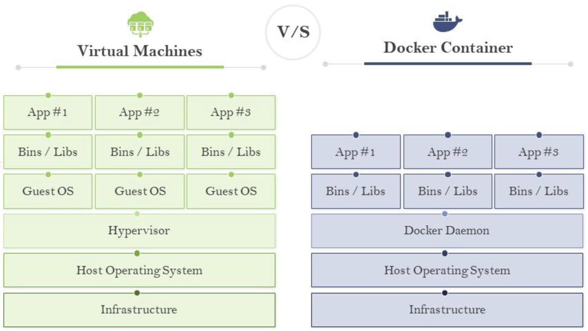
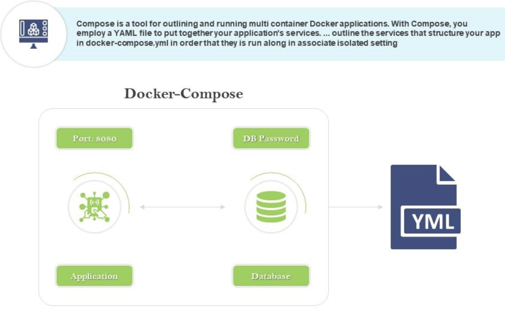

# Multiplatform Development and Application Containerization

<div class="right">[ Jan Pluskal &lt;pluskal@vut.cz&gt; ]

---

## Motivation

#### Multiplatform Development
- Developer preference - not limited to Windows
- Some tools are single-platform (or work better on some platforms)

#### Multiplatform Deployment
- Reaching more users
- Single/familiar technology
- Sharing code between platforms

---

## .NET Architecture



---

## .NET Implementations

- Microsoft supports:
  - .NET (5+ and later) (Multiplatform) (previously .NET Core)
  - .NET Framework (Windows)
  - Mono (Multiplatform)
  - UWP (Windows Apps)

- Other:
  - Xamarin (Mobile) (IOS, Android)
  - Unity
  - Tizen
  - ...

.NET APIs that are available on multiple .NET implementations unified by → **.NET Standard**


- References:
  - [.NET implementations](https://learn.microsoft.com/en-us/dotnet/fundamentals/implementations)
  - [.NET implementations supported by EF Core](https://learn.microsoft.com/en-us/ef/core/miscellaneous/platforms)
  - [.NET Standard](https://learn.microsoft.com/en-us/dotnet/standard/net-standard?tabs=net-standard-1-0)


---

## .NET Standard

- a formal specification of .NET APIs that are available on multiple .NET implementations
- motivation behind .NET Standard was to establish greater uniformity in the .NET ecosystem.
- Specification of API coverage
- *Interface* to program against
- Eliminates conditional compilation

**.NET 5 and later versions adopt a different approach to establishing uniformity that eliminates the need for .NET Standard in most scenarios.**
[No new versions of .NET Standard will be released.](https://devblogs.microsoft.com/dotnet/the-future-of-net-standard/)

+++

https://dotnet.microsoft.com/en-us/platform/dotnet-standard#versions


---

## .NET Core / .NET 5+

- Unified cross-platform runtime
  - Operating Systems (Windows, MacOS, Linux) and Architectures (x86, x64, ARM)
- Open Source
  - Managed by Microsoft
  - [.NET Core GitHub](https://github.com/dotnet/core)
  - [.NET Core Libraries GitHub](https://github.com/dotnet/runtime)

---

## Target Framework Monikers (TFM)

| Target                     | TFM            |
| -------------------------- | -------------- |
| .NET 8.0                   | net8.0         |
| .NET Standard 2.1          | netstandard2.1 |
| .NET Core                  | netcoreapp3.1  |
| .NET Framework 4.8         | net48          |
| Universal Windows Platform | uap10.0        |
| .NET 8.0 Android           | net8.0-android |

- References:
  - [Latest versions](https://learn.microsoft.com/en-us/dotnet/standard/frameworks#latest-versions)
  - [Supported target frameworks](https://learn.microsoft.com/en-us/dotnet/standard/frameworks#supported-target-frameworks)
  - [.NET 5+ OS-specific TFMs](https://learn.microsoft.com/en-us/dotnet/standard/frameworks#net-5-os-specific-tfms)

+++

```xml
<Project Sdk="Microsoft.NET.Sdk">

  <PropertyGroup>
    <TargetFramework>net8.0</TargetFramework>
  </PropertyGroup>

...

</Project>
```

+++

```xml
<Project Sdk="Microsoft.NET.Sdk">

  <PropertyGroup>
    <TargetFrameworks>net7.0;netstandard2.1</TargetFrameworks>
  </PropertyGroup>

...

</Project>
```

+++

### Compatibility pitfalls 

```xml
<Project Sdk="Microsoft.NET.Sdk">

  <PropertyGroup>
    <TargetFrameworks>netstandard1.4;net40;net45</TargetFrameworks>
  </PropertyGroup>

  <!-- Conditionally obtain references for the .NET Framework 4.0 target -->
  <ItemGroup Condition=" '$(TargetFramework)' == 'net40' ">
    <Reference Include="System.Net" />
  </ItemGroup>

  <!-- Conditionally obtain references for the .NET Framework 4.5 target -->
  <ItemGroup Condition=" '$(TargetFramework)' == 'net45' ">
    <Reference Include="System.Net.Http" />
    <Reference Include="System.Threading.Tasks" />
  </ItemGroup>

</Project>
```

+++

```C#
public class MyClass
{
    static void Main()
    {
#if NET40
        Console.WriteLine("Target framework: .NET Framework 4.0");
#elif NET45
        Console.WriteLine("Target framework: .NET Framework 4.5");
#else
        Console.WriteLine("Target framework: .NET Standard 1.4");
#endif
    }
}
```

References:
- [Preprocessor symbols](https://learn.microsoft.com/en-us/dotnet/standard/frameworks#preprocessor-symbols)
  
---

## Portability Analyzer

- Tool to check API compatibility
  - CLI tool
  - Visual Studio extension


References:
- [The .NET Portability Analyzer](https://learn.microsoft.com/en-us/dotnet/standard/analyzers/portability-analyzer)

---

## Multiplatform UI

- *Mono*
  - Multiplatform Windows Forms implementation
  - Subset of APIs

- *Xamarin.Forms*
  - Android, iOS, UWP Windows

- *MAUI*
  - Evolution of *Xamarin.Forms*
  - Android, iOS, Windows, MacOS, Tizen

---

## Deployment

+++

### Runtime Identifiers (RID)

- Identify target platforms
- Used for platform-specific assets in NuGet packages
- A graph of values, the most specific match is used
- `[os].[version]-[architecture]-[additional qualifiers]`


```c
   linux-arm64    linux-arm32
       |     \   /     |
       |     linux     |
       |       |       |
  unix-arm64   |    unix-x64
           \   |   /
             unix
               |
              any
```

References:
- [.NET RID Catalog](https://learn.microsoft.com/en-us/dotnet/core/rid-catalog)

+++

### `dotnet publish`

- `dotnet publish` compiles the application, reads through its dependencies specified in the project file, and publishes the resulting set of files to a directory.
- The output includes the following assets:
  - *Intermediate Language (IL)* code in an *assembly* with a `dll` extension.
  - A `.deps.json` file that includes all of the dependencies of the project.
  - A `.runtimeconfig.json` file that specifies the shared runtime that the application expects, as well as other configuration options for the runtime (for example, garbage collection type).
  - The *application's dependencies*, which are copied from the NuGet cache into the output folder
- Implicit restore - restores NuGet packages, can be disabled with option `--no-restore` 

References:
- [Arguments, options, ...](https://learn.microsoft.com/en-us/dotnet/core/tools/dotnet-publish#arguments)


+++

### Framework-dependent

- `dotnet publish`
  - App & third-party libraries
  - *Cross-platform* binary (.dll)
  - *Platform-specific* executable
- `dotnet <file.dll>`
  - Requires .NET to be installed
  - .NET can be updated independently

+++

### Self-contained

- `dotnet publish -r <RID>`
  - Bundled runtime & standard libraries
  - *Platform-specific* executable
  - Control .NET version
  - Larger output
  - `--sc|--self-contained [true|false]` argument, default is `true` if `-r|--runtime <RUNTIME_IDENTIFIER>` is specified

+++

### Trimming

- Removal of unused code
- Based on build time analysis
- Dynamic runtime behavior not caught during build time can cause issues

```
<PropertyGroup>
    <PublishTrimmed>true</PublishTrimmed>
</PropertyGroup>
```

---

## Virtualization, Containerization

+++

### What is Virtualization


+++

### What is Containerization


+++

### Advantages of Containerization over Virtualization


---

## Containers

+++

Distribution and deployment technology

- Lightweight VMs
- Application only — no hardware, no kernel
- *Namespaces* — kernel feature
  - `man unshare`
  - `mount`, `UTS`, `IPC`, `network`, `PID`, `cgroup`, `user`, `time`
- Open Container Initiative - common set of specifications

+++

### Why Are Containers Useful?

- Software makes demands and assumptions about the environment in which it executes
- Dependencies on other software components
- Version compatibility
- Build-time variability
- Finding dependencies
- Non-software artifacts (e.g., configuration)
- Conflicting assumptions

=> Containers try to capture the necessary environment, isolate it and make it transferable

"It works on my PC" -> "Here's my PC"

+++



---

## Container Runtimes

- Low-level executor
- Consumes resources (mountpoints/configuration) from engines
- Interfaces with the kernel to spawn processes and set up namespaces

E.g., runc, crun, youkai, kata-containers

---

## Container Engines

- Handle user/API input
- Manage available images
- Prepare resources for runtime (root directory/configuration)
- Call the runtime

E.g., Docker, Podman, CRI-O

---

## Container Orchestrators

- Varied features
- Declarative definition of deployment units
- Dynamic deployment scheduling

E.g., Docker Compose, Docker Swarm, Kubernetes, Apache Mesos

---

## Container Images

- Layered data + metadata
- Each layer is its own archive
- Running an image means extracting all layers in order

+++

### Image Manifest

```json
{
  "schemaVersion": 2,
  "mediaType": "application/vnd.oci.image.manifest.v1+json",
  "config": {
    "mediaType": "application/vnd.oci.image.config.v1+json",
    "size": 7023,
    "digest": "sha256:b5b2b2c507a0944348e0303114d8d93aaaa081732b86451d9bce1f432a537bc7"
  },
  "layers": [
    {
      "mediaType": "application/vnd.oci.image.layer.v1.tar+gzip",
      "size": 32654,
      "digest": "sha256:9834876dcfb05cb167a5c24953eba58c4ac89b1adf57f28f2f9d09af107ee8f0"
    },
    {
      "mediaType": "application/vnd.oci.image.layer.v1.tar+gzip",
      "size": 73109,
      "digest": "sha256:ec4b8955958665577945c89419d1af06b5f7636b4ac3da7f12184802ad867736"
    }
  ]
}
```

---

## Building Images

- Dockerfile (Containerfile)
- BuilKit
- Buildah

+++

### Dockerfile

- Instructions to create an image
- Instructions create image layers

```dockerfile
FROM mcr.microsoft.com/dotnet/sdk:7.0
COPY . /app
WORKDIR /app
RUN dotnet publish
CMD bin/MyApp.exe
```

+++

### BuildKit

Advanced "Dockerfile" builder, uses intermediate language

- Dockerfile
- Buildpacks
- Mockerfile
- Gockerfile
- bldr (Pkgfile)
- HLB
- Earthfile (Earthly)
- Cargo Wharf (Rust)
- Nix
- mopy (Python)
- envd (starlark)
- Blubber
- Bass

+++

### Buildah

CLI for manipulating images

| Command                                          | Description                                                                            |
| ------------------------------------------------ | -------------------------------------------------------------------------------------- |
| [buildah-add(1)](/docs/buildah-add.1.md)         | Add the contents of a file, URL, or a directory to the container.                      |
| [buildah-build(1)](/docs/buildah-build.1.md)     | Build an image using instructions from Containerfiles or Dockerfiles.                  |
| [buildah-commit(1)](/docs/buildah-commit.1.md)   | Create an image from a working container.                                              |
| [buildah-config(1)](/docs/buildah-config.1.md)   | Update image configuration settings.                                                   |
| [buildah-copy(1)](/docs/buildah-copy.1.md)       | Copies the contents of a file, URL, or directory into a container's working directory. |
| [buildah-mount(1)](/docs/buildah-mount.1.md)     | Mount the working container's root filesystem.                                         |
| [buildah-run(1)](/docs/buildah-run.1.md)         | Run a command inside of the container.                                                 |
| [buildah-umount(1)](/docs/buildah-umount.1.md)   | Unmount a working container's root file system.                                        |
| [buildah-unshare(1)](/docs/buildah-unshare.1.md) | Launch a command in a user namespace with modified ID mappings.                        |

---


## Docker

+++

### What is Docker?


+++

### Benefits


+++

### Architecture


+++

### Use cases


+++

### Virtualization vs. Containerization



+++

### Dockerfile


+++

### Image


+++

### Docker Hub


+++

### Docker Compose




---

# References
- [Docker slides](https://www.slideteam.net/introduction-to-dockers-and-containers-powerpoint-presentation-slides.html)

+++

## Credits
* Michal Koutenský - for slides preparation 2022/2023
  
---

<!-- Has to stay, because otherwise static build would not contain logo resources referenced in CSS theme -->

+++
