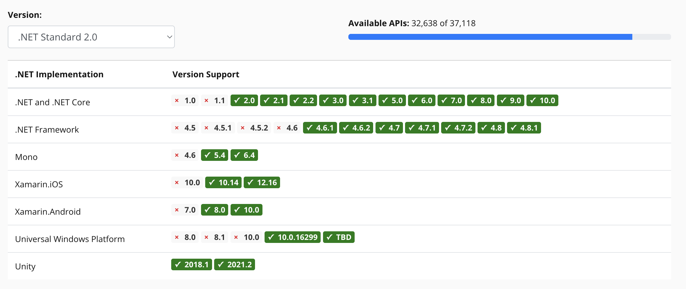
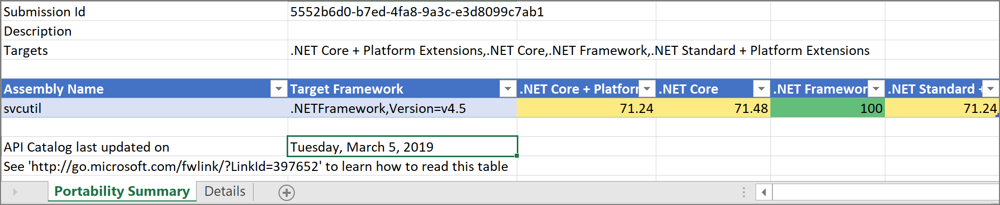

# Cross-platform Development and Application Containerization

<div class="right">[ Jan Pluskal <pluskal@vut.cz> ]

---

## Motivation

#### Cross-platform Development
- Developer preference - not limited to Windows
- Some tools are single-platform (or work better on some platforms)

#### Cross-platform Deployment
- Reaching more users
- Single/familiar technology
- Sharing code between platforms

---

## .NET Architecture



---

## .NET Implementations

- Microsoft supported (current focus):
  - .NET (5+ and later) (cross-platform) (previously .NET Core)
  - .NET Framework (Windows-only legacy compatibility target)

- Current .NET application platforms:
  - MAUI (.NET for Android, iOS, macOS, Windows)
  - ASP.NET Core / Worker services / Console apps (cross-platform)

- Niche or historical ecosystems:
  - Unity, Tizen (specialized)
  - Mono, UWP, Xamarin.Forms (legacy/historical context)

.NET APIs that are available on multiple .NET implementations unified by → **.NET Standard**


- References:
  - [.NET implementations](https://learn.microsoft.com/en-us/dotnet/fundamentals/implementations)
  - [.NET implementations supported by EF Core](https://learn.microsoft.com/en-us/ef/core/miscellaneous/platforms)
  - [.NET Standard](https://learn.microsoft.com/en-us/dotnet/standard/net-standard?tabs=net-standard-1-0)


---

## .NET Standard

- A formal specification of .NET APIs that are available on multiple .NET implementations.
- The motivation behind .NET Standard was to establish greater uniformity in the .NET ecosystem.
- Standardized API coverage across implementations
- *Interface* to program against
- Reduces the need for conditional compilation

**.NET 5 and later versions adopt a different approach to establishing uniformity that eliminates the need for .NET Standard in most scenarios.**
[No new versions of .NET Standard will be released.](https://devblogs.microsoft.com/dotnet/the-future-of-net-standard/)

+++

https://dotnet.microsoft.com/en-us/platform/dotnet-standard#versions



---

## Modern .NET (5+)

- Unified cross-platform runtime
  - Operating systems (Windows, macOS, Linux) and architectures (x86, x64, ARM)
- Open Source
  - Managed by Microsoft
  - [.NET Runtime GitHub](https://github.com/dotnet/runtime)
  - [.NET SDK GitHub](https://github.com/dotnet/sdk)

---

## Target Framework Monikers (TFM)

| Target                     | TFM            |
| -------------------------- | -------------- |
| .NET 10.0                  | net10.0        |
| .NET 8.0 (still common)    | net8.0         |
| .NET Standard 2.1          | netstandard2.1 |
| .NET Framework 4.8.1       | net481         |
| .NET 10.0 Android          | net10.0-android |

- References:
  - [Latest versions](https://learn.microsoft.com/en-us/dotnet/standard/frameworks#latest-versions)
  - [Supported target frameworks](https://learn.microsoft.com/en-us/dotnet/standard/frameworks#supported-target-frameworks)
  - [.NET 5+ OS-specific TFMs](https://learn.microsoft.com/en-us/dotnet/standard/frameworks#net-5-os-specific-tfms)

+++

```xml
<Project Sdk="Microsoft.NET.Sdk">

  <PropertyGroup>
    <TargetFramework>net10.0</TargetFramework>
  </PropertyGroup>

...

</Project>
```

+++

```xml
<Project Sdk="Microsoft.NET.Sdk">

  <PropertyGroup>
    <TargetFrameworks>net10.0;netstandard2.1</TargetFrameworks>
  </PropertyGroup>

...

</Project>
```

+++

### Compatibility pitfalls 

When targeting incompatible frameworks, use conditional references and framework symbols carefully:

```xml
<Project Sdk="Microsoft.NET.Sdk">

  <PropertyGroup>
    <TargetFrameworks>net10.0;net481</TargetFrameworks>
  </PropertyGroup>

  <!-- Conditionally add references only for .NET Framework builds -->
  <ItemGroup Condition=" '$(TargetFramework)' == 'net481' ">
    <Reference Include="System.Configuration" />
  </ItemGroup>

</Project>
```

+++

```C#
public class MyClass
{
    static void Main()
    {
#if NET10_0
        Console.WriteLine("Target framework: .NET 10.0");
#elif NETFRAMEWORK
        Console.WriteLine("Target framework: .NET Framework 4.8.1");
#else
        Console.WriteLine("Target framework: Other");
#endif
    }
}
```

References:
- [Preprocessor symbols](https://learn.microsoft.com/en-us/dotnet/standard/frameworks#preprocessor-symbols)
  
---

## Portability Analyzer

- Tool to check API compatibility during migrations
  - CLI tool
  - Visual Studio extension
  - For new projects, prefer modern Roslyn/.NET analyzers in IDE and CI



References:
- [The .NET Portability Analyzer](https://learn.microsoft.com/en-us/dotnet/standard/analyzers/portability-analyzer)

---

## Cross-platform UI

- *MAUI*
  - Modern .NET UI stack
  - Android, iOS, Windows, macOS

- *Avalonia*
  - Community desktop UI framework
  - Windows, macOS, Linux

- Legacy note:
  - Xamarin.Forms, UWP, and Mono-based UI stacks are primarily historical in new development

---

## Deployment

+++

### Runtime Identifiers (RID)

- Identify target platforms
- Used for platform-specific assets in NuGet packages
- A graph of values, the most specific match is used
- `[os].[version]-[architecture]-[additional qualifiers]`
- Example: `linux-x64` can fall back to more generic `linux` when needed

```
   linux-arm64    linux-arm32
       |     \   /     |
       |     linux     |
       |       |       |
  unix-arm64   |    unix-x64
           \   |   /
             unix
               |
              any
```

References:
- [.NET RID Catalog](https://learn.microsoft.com/en-us/dotnet/core/rid-catalog)

+++

### `dotnet publish`

- `dotnet publish` compiles the application, reads through its dependencies specified in the project file, and publishes the resulting set of files to a directory.
- The output includes the following assets:
  - *Intermediate Language (IL)* code in an *assembly* with a `dll` extension.
  - A `.deps.json` file that includes all of the dependencies of the project.
  - A `.runtimeconfig.json` file that specifies the shared runtime that the application expects, as well as other configuration options for the runtime (for example, garbage collection type).
  - The *application's dependencies*, which are copied from the NuGet cache into the output folder
- Implicit restore - restores NuGet packages, can be disabled with option `--no-restore` 

References:
- [Arguments, options, ...](https://learn.microsoft.com/en-us/dotnet/core/tools/dotnet-publish#arguments)


+++

### Framework-dependent

- `dotnet publish`
  - App & third-party libraries
  - *Cross-platform* binary (.dll)
  - *Platform-specific* executable
- `dotnet <file.dll>`
  - Requires .NET to be installed
  - .NET can be updated independently

+++

### Self-contained

- `dotnet publish -r <RID>`
  - Bundled runtime & standard libraries
  - *Platform-specific* executable
  - Control .NET version
  - Larger output
  - `--sc|--self-contained [true|false]` argument, default is `true` if `-r|--runtime <RUNTIME_IDENTIFIER>` is specified

+++

### Deployment Decision Matrix

| Option | Runtime on target machine | Binary size | Portability | Typical usage |
| ------ | ------------------------- | ----------- | ----------- | ------------- |
| Framework-dependent | Required (.NET installed) | Smallest | Good (per-OS publish) | Internal services, managed servers |
| Self-contained | Not required | Larger | Limited to target RID | Air-gapped hosts, strict runtime control |
| Container image | Not required on host (container runtime required) | Medium to large | High (same image per platform) | Cloud-native deployment, CI/CD |

+++

**Trade-offs visualization:**
```
                Binary Size
                    ▲
            Large   │     Self-contained
                    │          ●
                    │         / \
      Container ●   │        /   \
                    │       /     \
                    │      /       \
            Small   │     /         \
                    │    ● FWK-dep   \
                    │   /             \
                    └──────────────────► Portability
                         Low      High
                                   (Containers most portable,
                                    shared image per platform)
```

Rule of thumb:
- Start with framework-dependent for simple server environments.
- Use self-contained when host runtime management is difficult.
- Use containers when you need reproducible environment and deployment parity.

+++

### Trimming

- Removal of unused code
- Based on build time analysis
- Dynamic runtime behavior not caught during build time can cause issues

```
<PropertyGroup>
    <PublishTrimmed>true</PublishTrimmed>
</PropertyGroup>
```

+++

### Common Deployment Pitfalls

- RID mismatch (`linux-x64` vs `linux-arm64`) leads to runtime failures on target hosts.
- Self-contained does not mean cross-platform: publish separately per RID.
- Trimming can remove reflection-discovered types unless configured explicitly.
- Container image choice matters: `aspnet` vs `runtime` vs `runtime-deps`.
- Native dependencies in Linux containers are still your responsibility.

---

## Virtualization, Containerization

+++

### What is Virtualization

- Virtualization abstracts hardware into software-defined resources.
- A hypervisor runs multiple isolated guest operating systems on one physical host.
- Each VM includes:
  - Guest OS
  - Application binaries and dependencies
  - Virtualized CPU, memory, storage, and network
- Common use cases:
  - Running legacy workloads
  - Strong isolation between tenants
  - OS-level testing across multiple distributions

Examples: VMware ESXi, Hyper-V, KVM, VirtualBox

+++

### What is Containerization

- Containerization packages an application and its user-space dependencies.
- Containers share the host kernel but isolate processes and resources.
- Isolation primitives:
  - Namespaces (process, network, mount, user)
  - cgroups (CPU, memory, I/O limits)
  - Layered filesystems (copy-on-write image layers)
- A container typically includes:
  - Application process
  - Required runtime and libraries
  - Configuration and startup command

---

## Containers

+++

### Virtual Machines vs Containers: Trade-offs

| Aspect | Virtual Machines | Containers |
| ------ | ---------------- | ---------- |
| Isolation boundary | Hypervisor + guest OS | Process isolation on host kernel |
| Startup time | Seconds to minutes | Milliseconds to seconds |
| Resource overhead | Higher (full OS per instance) | Lower (shared kernel) |
| OS flexibility | Different OS per VM | Same kernel family as host |
| Typical fit | Legacy apps, strict isolation | Microservices, CI/CD, cloud-native apps |

Key strengths:
- **Containers** win on speed, density, and reproducibility.
- **VMs** provide stronger isolation and OS independence.

+++

**Architecture comparison:**
```
   Virtual Machines              Containers
┌──────────────────┐         ┌──────────────┐
│ App + Libraries  │         │ App 1        │
│   (Guest OS)     │         ├──────────────┤
├──────────────────┤         │ App 2        │
│   Hypervisor     │         ├──────────────┤
├──────────────────┤         │ Container    │
│ Host OS Kernel   │         │ Runtime      │
├──────────────────┤         ├──────────────┤
│ Infrastructure   │         │ Host OS      │
└──────────────────┘         │ Kernel       │
                             ├──────────────┤
                             │Infrastructure│
                             └──────────────┘

  Heavier, slower        Lightweight, fast
  Stronger isolation     Process isolation
```

+++

### Container Technology Fundamentals

Containers use kernel features to isolate and restrict process access:
- *Namespaces* — isolate view of system resources
  - `mount`, `UTS`, `IPC`, `network`, `PID`, `cgroup`, `user`, `time`
  - Each namespace type isolates a different aspect
- *cgroups* — limit and manage resource usage
  - CPU, memory, I/O bandwidth constraints
- *Layered filesystems* — copy-on-write storage
  - Each layer is an immutable archive; changes go to a writable layer

**Open Container Initiative (OCI)** standardizes image format and runtime interface.

+++

**Isolation layers:**
```
┌─────────────────────────────────────────┐
│  Container A         │  Container B     │
│  (PID ns)            │  (PID ns)        │
│  Processes: 1,2      │  Processes: 1,2  │  Process isolation
├─────────────────────────────────────────┤
│  Network ns  │  Mount ns  │  UTS ns     │  Resource namespaces
├─────────────────────────────────────────┤
│  cgroups: CPU limit, Memory limit       │  Resource limits
├─────────────────────────────────────────┤
│  Host OS Kernel (Shared)                │  Kernel sharing
├─────────────────────────────────────────┤
│  CPU, RAM, Storage                      │  Hardware
└─────────────────────────────────────────┘
```

+++

### Why Containers: Capturing Environment for Reproducibility

Problem solved:
- "It works on my PC" → Same image runs in dev, CI, and production.
- Eliminates dependency hell and environment drift.
- Encapsulates OS packages, libraries, config, and application together.

Container stack:
```
┌─ Containers (app process + libs + config) ─┐
│  Container runtime (containerd, runc)      │
│  Host OS kernel (namespaces, cgroups)      │
│  Infrastructure (CPU, memory, storage)     │
└──────────────────────────────────────────┘
```

Operational considerations:
- Kernel vulnerabilities affect all containers on the host.
- Resource limits must be configured; they don't auto-enforce.
- Persistent data should go to volumes, not image layers.

---

## Container Ecosystem Layers

| Layer | Examples | Role |
| ----- | -------- | ---- |
| **Runtimes** | runc, crun, kata, gVisor | Low-level: spawn processes, manage namespaces, cgroups |
| **Engines** | Docker, Podman, CRI-O | High-level: manage images, containers, networks, volumes |
| **Orchestrators** | Docker Compose, Kubernetes, Docker Swarm | Deploy and manage collections of containers declaratively |

**Architecture flow:**
```
Registry → Engine → Runtime → Containers
   ↑         ↑
User & Orchestrator
```

Orchestration layers (Compose, Kubernetes) coordinate many containers across engines.

---

## Container Images

- Layered data + metadata
- Each layer is its own archive
- Running an image means extracting all layers in order

+++

### Image Manifest

```json
{
  "schemaVersion": 2,
  "mediaType": "application/vnd.oci.image.manifest.v1+json",
  "config": {
    "mediaType": "application/vnd.oci.image.config.v1+json",
    "size": 7023,
    "digest": "sha256:b5b2b2c507a0944348e0303114d8d93aaaa081732b86451d9bce1f432a537bc7"
  },
  "layers": [
    {
      "mediaType": "application/vnd.oci.image.layer.v1.tar+gzip",
      "size": 32654,
      "digest": "sha256:9834876dcfb05cb167a5c24953eba58c4ac89b1adf57f28f2f9d09af107ee8f0"
    },
    {
      "mediaType": "application/vnd.oci.image.layer.v1.tar+gzip",
      "size": 73109,
      "digest": "sha256:ec4b8955958665577945c89419d1af06b5f7636b4ac3da7f12184802ad867736"
    }
  ]
}
```

---

## Building Images

- Dockerfile (Containerfile)
- BuildKit
- Buildah

+++

### Dockerfile: Build Strategy for Efficiency

`Dockerfile` is a declarative recipe for building images with layering in mind.

**Layering strategy** (least changed → most changed for cache efficiency):
```
┌─────────────────────────────────────────┐  ← Layer 6: Build/publish
│ Startup Command                         │
├─────────────────────────────────────────┤  ← Layer 5: Source code
│ Application Source Code (changes often) │     (rebuilt on each change)
├─────────────────────────────────────────┤  ← Layer 4: Dependencies
│ App Dependencies (NuGet, npm, pip)      │     (rebuilt if deps change)
├─────────────────────────────────────────┤  ← Layer 3: Runtime
│ Runtime Packages (language, framework)  │     (rebuilt if runtime changes)
├─────────────────────────────────────────┤  ← Layer 2: OS packages
│ OS Packages & System Dependencies       │     (rebuilt if OS deps change)
├─────────────────────────────────────────┤  ← Layer 1: Base image
│ Base Runtime Image (rarely changes)     │     (reused - cached)
└─────────────────────────────────────────┘
     Each layer is cached independently
     Only rebuild from changed layer onward
```

+++

**Why this order matters:**
- Each layer is cached; only rebuild from changed layer onward.
- Puts volatile content (source) at the top to maximize reuse.
- Multi-stage build keeps final runtime image small.

**Example .NET Dockerfile:**
```dockerfile
FROM mcr.microsoft.com/dotnet/sdk:10.0 AS build
WORKDIR /src
COPY . .
RUN dotnet publish -c Release -o /app/publish

FROM mcr.microsoft.com/dotnet/runtime:10.0 AS runtime
WORKDIR /app
COPY --from=build /app/publish .
ENTRYPOINT ["dotnet", "MyApp.dll"]
```

**Best practices:**
- Pin base image major version.
- Copy only publish output, not source tree.
- Prefer `ENTRYPOINT` array form (exec mode).
- Consider running as non-root user.

---


## Docker

+++

### What is Docker?

- Docker is a platform for building, packaging, shipping, and running containers.
- It uses OCI-compatible images and runtime interfaces.
- Key value:
  - Standard image format
  - Repeatable build process
  - Consistent CLI and API experience

Core workflow:
1. Build image from `Dockerfile`
2. Push image to registry
3. Pull and run image as a container

+++

### Benefits

- Cost and utilization
  - Better host utilization compared to full VM-per-app setups.
- Standardization and maintainability
  - Same packaging model across teams and environments.
- CI/CD acceleration
  - Reusable images and layer caching reduce build/deploy time.
- Environment consistency
  - Development and production run the same container artifacts.
- Multi-cloud portability
  - OCI images run across cloud providers and on-prem clusters.

+++

### Architecture

| Component | Responsibility |
| --------- | -------------- |
| Docker Client (`docker` CLI) | Sends commands (`build`, `pull`, `run`) |
| Docker Daemon (`dockerd`) | Builds images, manages containers, networks, and volumes |
| Registry (Docker Hub or private OCI registry) | Stores and distributes images |

**Workflow:**
```
Dockerfile → Image → Registry → Pull → Container ← Volume
```

Command flow:
1. `docker build` -> daemon builds layers and tags image.
2. `docker push` / `docker pull` -> daemon exchanges images with registry.
3. `docker run` -> daemon creates container from image and starts process.

+++

### Use cases

- Simplifying configuration and onboarding
- Improving developer productivity
- Server consolidation
- Multi-tenancy with controlled isolation
- CI/CD pipeline standardization
- Application isolation for conflicting dependencies
- Faster debugging and rollback workflows
- Rapid and repeatable deployments

+++

### Docker Workflow: Build, Push, Pull, Run

1. **Build image** from source and Dockerfile
   ```bash
   docker build -t cookbook-app:1.0.0 .
   ```
   Produces immutable image artifact.

2. **Push** to registry for distribution
   ```bash
   docker push myregistry.azurecr.io/cookbook-app:1.0.0
   ```

+++

3. **Pull** into target environment
   ```bash
   docker pull myregistry.azurecr.io/cookbook-app:1.0.0
   ```

4. **Run** as container instance
   ```bash
   docker run -d -p 8080:8080 --name app cookbook-app:1.0.0
   ```

Key property:
- One image produces many short-lived or long-lived container instances.
- Image is immutable; container is ephemeral.

+++

### Docker Hub

Docker Hub is a public OCI registry for publishing and consuming images.

Typical collaboration flow:
1. Developer builds image locally.
2. CI tags and pushes image (for example `org/app:1.4.2`).
3. Runtime environments pull exact tag or digest.

Good practices:
- Prefer immutable version tags and digests.
- Use official/minimal base images.
- Enable vulnerability scanning and signed images where possible.

+++

### Docker Compose

Docker Compose defines multi-container applications in YAML.

Example:
```yaml
services:
  app:
    image: cookbook-app:latest
    ports:
      - "8080:8080"
    depends_on:
      - db
  db:
    image: postgres:16
    environment:
      POSTGRES_PASSWORD: example
    volumes:
      - pgdata:/var/lib/postgresql/data

volumes:
  pgdata:
```

Commands:
- `docker compose up -d`
- `docker compose logs -f`
- `docker compose down`


---

## Hands-on Demos

Use these small demos during class or self-study:
- `assets/examples/01-hello-nginx`
- `assets/examples/02-layer-caching-node`
- `assets/examples/03-compose-web-db`

+++

### Demo 1: Static Site Container

Path: `assets/examples/01-hello-nginx`

Learning goal:
- Build and run a minimal Docker image.
- Verify container-to-host port mapping.

Run:
```bash
cd assets/examples/01-hello-nginx
docker build -t ics-demo1 .
docker run --rm -p 8081:80 ics-demo1
```

Open `http://localhost:8081`.

+++

### Demo 2: Layer Caching in Practice

Path: `assets/examples/02-layer-caching-node`

Learning goal:
- Understand Docker layer caching with a C# web app.
- See how Dockerfile order affects `dotnet restore` reuse.

Run:
```bash
cd assets/examples/02-layer-caching-node
docker build -t ics-demo2 .
docker run --rm -p 8082:8080 ics-demo2
```

Suggested exercise:
1. Build once.
2. Modify only `Program.cs`.
3. Build again and observe cached `dotnet restore` layer.

+++

### Demo 3: Multi-container with Compose

Path: `assets/examples/03-compose-web-db`

Learning goal:
- Start and manage multiple services with a .NET API + PostgreSQL.
- Observe service networking, database connectivity, and persisted volume data.

Run:
```bash
cd assets/examples/03-compose-web-db
docker compose up -d
docker compose ps
```

Check API endpoints:
- `http://localhost:8083/`
- `http://localhost:8083/db-check`

Open `http://localhost:8084` (Adminer) and connect to:
- Server: `db`
- Username: `app`
- Password: `apppass`
- Database: `appdb`

Cleanup:
```bash
docker compose down
# or remove data volume too
docker compose down -v
```


---

# References
- [Docker slides](https://www.slideteam.net/introduction-to-dockers-and-containers-powerpoint-presentation-slides.html)

+++

## Credits
* Michal Koutenský - for slides preparation 2022/2023
  
---

<!-- Has to stay, because otherwise static build would not contain logo resources referenced in CSS theme -->

+++
