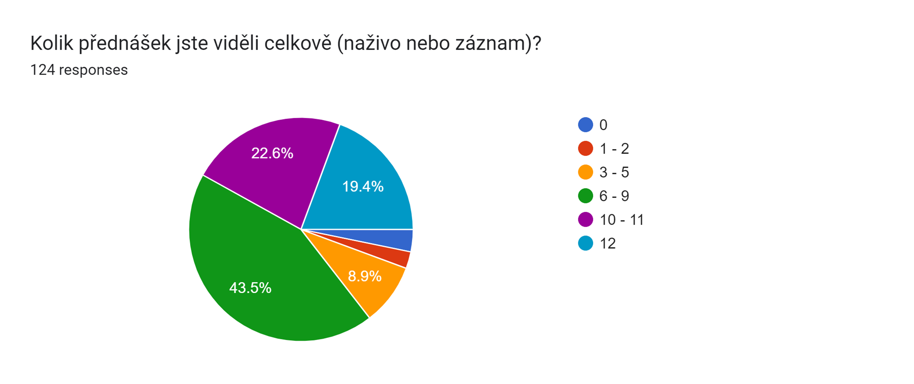
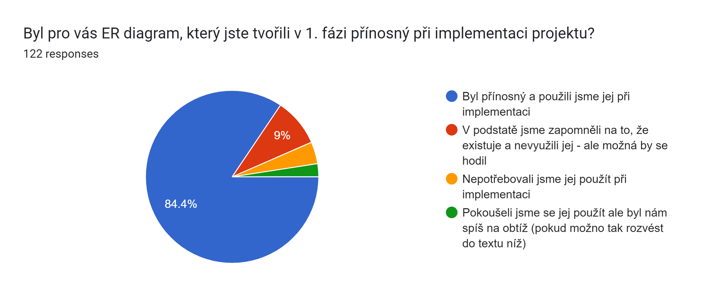
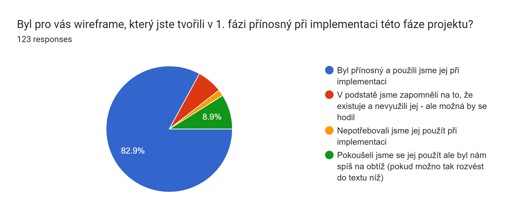
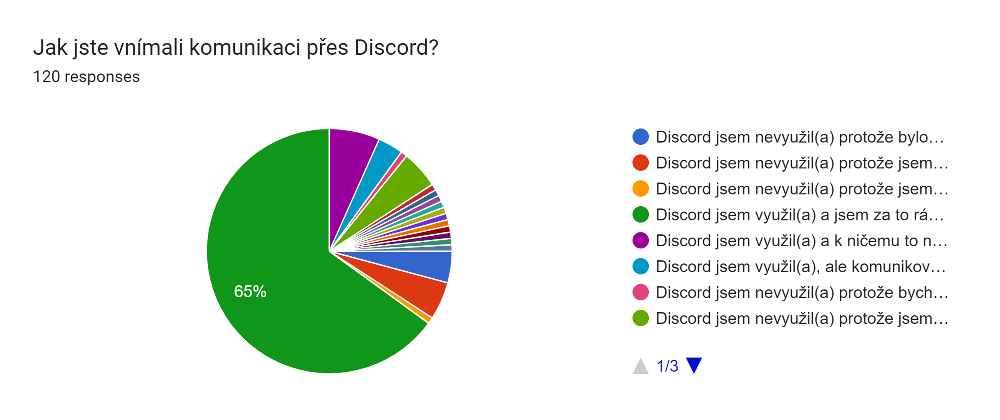

# ICS zpracování feedbacku a plán na rok 2021/2022

## Úvod
Na úvod moc děkujeme všem co vyplnili feedback k předmětu. Dotazníků bylo vyplněno:
- [Dotazník po 1. fázi projektu](./dotaznik_1_faze_projektu.md) - 74 odpovědí
- [Dotazník po 2. fázi projektu](./dotaznik_2_faze_projektu.md) - 81 odpovědí
- [Závěrečný dotazník](./zaverecny_dotaznik_2022.md) - 124 odpovědí

## Disclaimer
Všechno, co je tady uvedeno jsou aktuálně plány, které ukazují naše záměry ale nereprezentují již hotové kroky. Snažíme se komunikovat co nejtransparentněji naše plány a doufáme, že to bude mít pozitivní přínos jak pro předměty, tak pro Váš čas strávený na fakultě. Pokusíme se co nejvíce z nich naplnit, pokud se chcete zapojit v jakékoliv kapacitě tak se určitě ozvěte a uvítáme jakoukoliv pomoc. Zároveň jsme jenom lidé, takže pokud něco nestihneme tak nás z toho prosím neviňte.

## Cíle předmětů ICS a IW5
ICS si klade za úkol několik cílů. Ve feedbacku zaznělo, že někteří studenti očekávali od předmětu, že se budeme víc věnovat jazyku C# a byli překvapeni větším důrazem na samotný vývoj aplikace, návrhové vzory a aspektů praktického vývoje aplikací. Chtěli bychom tedy adresovat tyto připomínky. 

Snažíme se, aby vývoj projektů v ICS a IW5 do nějaké míry ilustroval to, jak vypadá reálný vývoj v praxi a ukázal studentům kromě konstruktů jazyka C# i praktiky používané při vývoji aplikací pomocí frameworku .NET a další navázané témata jako ukládání dat, návrh architektury aplikace i základy práce s uživatelským rozhraním. Mohli bychom se zaměřit na „suchý“ teoretický výčet všech vlastností jazyka C# a ukázat všechna jeho zákoutí, se kterými se pravděpodobně při vývoji ani nepotkáte, ale myslíme si, že je lepší si vývoj osahat prakticky, a to se nedá moc nahradit jenom pomocí přednášky. V IW5 pak chceme posouvat to, co se učilo v ICS na další úroveň a učit se o dalších aspektech, se kterýma se můžete při vývoji potkat.

Feedback jsme si podrobně prošli a našli jsme tam připomínky, které adresují konkrétní věci a které jsou velmi přínosné a na základě nich chceme přistoupit k zlepšení předmětů a zejména k lepšímu zpřístupnění předmětu ICS pro studenty, kteří s objektově orientovaným programováním začínají a bylo pro ně obtížné se v látce zorientovat. Rozvedeme si je blíže v dalších sekcích.

## Vylepšení popisu předmětu na kartě předmětu
Část feedbacku směrovala k tomu, že studenti čekali něco jiného z popisu v kartě předmětu. Pokusíme se tedy upravit popis tak, aby bylo více zřejmé, že kromě jazyku C# se předmět věnuje také návrhovým vzorům a architektuře aplikace.

## Úpravy v kódu CookBook 👨‍🍳📘
Velkou částí předmětu je vzorový kód v CookBook, který se používá v cvičeních, jako reference pro projekt a má ilustrovat to, co se snažíme v předmětu ukázat. Zároveň se často vyskytují připomínky ke kódu ve feedbacku. Snažíme se kód pořád upravovat a vylepšovat (a také zjednodušovat).

### Úpravy od předchozího roku
Když se podíváme na plány z předchozího roku, tak se z nich povedlo:
- **Odstranit Entity Factory**
- **Upravit kód tak, aby používal repozitáře, fasády a UnitOfWork, abychom neměli 2 verze kódu.** Zároveň přidat názornější vysvětlení rozdílu mezi repozitářem a fasádou i s ilustrací v kódu. Chceme se tím vyhnout tomu, aby nevznikali 2 různé varianty obtížnosti projektu a zbytečné zmatení z toho, co z kódu se vlastně má použít a co není potřeba v jednotlivých variantách. 
- **Odstranit ViewModelLocator.** Nebudeme ukazovat 2 možnosti resolvování ViewModelů, ukážeme jednu variantu s použitím IoC/DI abychom zbytečně nemátli. S tím zároveň souvisí to, že chceme rozšířit vysvětlení IoC/DI aby to bylo probráno víc podrobně a názorně.
- **Odstraníme InMemory databázi a v testech místo ní použijeme SQLite databázi.** InMemory databáze se v několika případech chovala jinak než „opravdová“ databáze a přijde nám, že její zapojení způsobovalo spíš komplikace při pochopení toho, co se v testech a programu děje než že by nějak zásadně pomohla.

### Úpravy, které jsme plánovali ale nerealizovali se (zatím)
- **Odstranit Model Wrappery** - Tady jsme při implementaci narazili na nějaká omezení. Zkusíme tento bod ještě znovu vyhodnotit při změně technologie.
- **Nahradit null! pomocí required v rámci .NET 6.** Klíčové slovo required se nakonec do .NET 6 nedostalo, takže jsme jej použít nemohli. Mělo by se objevit v .NET 7, takže pak jej zapracujeme.
- **Zjednodušit kód při ukládání změn tak, aby se pro vazby používali ID navázaných entit a ne mapování všech hodnot v navázaných entitách.** Nakonec jsme se v letošní verzi rozhodli využít automatického zpracování navázaných kolekcí. Ale máme nějaké plány jak toto v další verzi zjednodušit a upravit.

### Nadcházející úpravy v kódu
Kód samozřejmě plánujeme upravovat opět a teď nás čeká několik významných úprav. Pojďme se na ně podívat:
- **Přechod na platformu .NET MAUI** - Jelikož release .NET MAUI přišel až ke konci letního semestru tak jsme jej nemohli použít letos. Ale plánujeme to do dalšího roku.
- **Ukázka navigace v aplikaci.** Toto souvisí s přechodem na .NET MAUI, jelikož tam je pevněji strukturovaná navigace v aplikaci a můžeme ukázat jak se "má dělat". Byl to zároveň jeden z často zmiňovaných bodů ve feedbacku, jelikož ve WPF jsme navigaci neukazovali - doufáme, že tento bod tímto zlepšíme.
- **Zjednodušení abstrakce na vrstvě fasád a mapování.** Aktuální implementace využívá mapování pomocí AutoMapperu, které je použitelné při mapování kolekcí (zejména využito při ukládání navázaných entit do databáze). Při přechodu na .NET MAUI se pokusíme zamyslet nad návrhem aplikace a vyřešit UI tak, abychom takovou operaci nepotřebovali. Pokud se to povede a nenarazíme někde na blokující problém tak dalším krokem, který plánujeme je nahrazení AutoMapperu pomocí ručního mapování, které by mělo být názornější na použití (i když to bude znamenat psaní více kódu) a přesunutí části kódu z vrstvy repozitářů do vrstvy fasád - pro lepší ilustraci jejich funkcí. Tím by mohla z kódu zmizet výrazná část "magie", která byla zmiňována ve feedbacku.
- **Odstraníme InMemory databázi.** V kódu se aktuálně nepoužívá a její použití omylem při testech by mohlo vést k zbytečným chybám. Rozhodli jsme se, že tuto implementaci úplně odstraníme z kódu.

## Přednášky a látka v ICS

- **Sledovanost přednášek byla vysoká.** Fyzická prezence na přednáškách sice vysoká nebyla, ale dle dotazníků velká většina studentů viděla alespoň polovinu přednášek (85.5% studentů) alespoň pomocí streamu nebo záznamu. Pro zlepšení fyzické prezence bude příští rok jiný termín přednášek (info dále v textu). Nicméně streamy a záznamy zachováme i nadále, jelikož jsou využívány.
- **Vytvoříme FAQ s často kladenými dotazy (a odpověďmi).** Jelikož se některé otázky v průběhu řešení projektu opakovali bylo náročné ze strany studentů hledat odpovědi v komunikaci na Discordu a ze strany vyučujících opakovat opakovaně na stejné dotazy. Zkusíme tedy zavést FAQ, kde budeme spisovat časté a opakující se dotazy i s odpověďmi. Něco zkusíme sepsat již před začátkem semestru (co si pamatujeme nebo dohledáme), zbytek budeme přidávat v průběhu jak budou dotazy přibývat.
- **Zkusíme rozšířit část o debuggovaní v úvodu předmětu.** Jelikož jsme si při konzultacích všimli, že mnoho týmů nevyužívá možností Visual Studia, které by jim mohli být nápomocné při ladění problémů v aplikaci - zkusíme to více ukázat a vysvětlit.
- **Úprava přednášky BCL a LINQ.** V přednášce o BCL a LINQ je hromada látky, která ale není všechna potřebná pro účely tohto předmětu a naopak základní použití LINQ by to chtělo ukázat více názorně. Obsah této přednášky budeme tedy revidovat.
- **Ukážeme jak si vygenerovat ER diagram z kódu.** Tento nástroj může posloužit zejména jako validace toho, že studenti mají v kódu napsané entity tak, jak si myslí, že fungují - a že tedy vygenerovaný ER diagram sedí s jejich představami.
- **Pohled na data v SQL databázi a SQLite.** Další nástroj, který by mohl pomoct pŕi vývoji a ladění chyb je pohled na data, která jsou aktuálně v databázi (nebo SQLite souboru při testech). Tuto část ukážeme názorněji aby byla použitelná při vývoji.
- **Zdůraznění M:N vazby ve vzorovém kódu.** Ve vzorovém kódu je M:N vazba ilustrována pomocí vazební entity IngredientAmountEntity. Mnoho týmů se snažilo vytvořit vazbu M:N pomocí automaticky vygenerované tabulky bez vazební entity a řešilo pak problémy s tím spojené (hlavně cascade delete). Zdůrazníme tedy, že doporučujeme vazební entitu využívat a že ve vzorovém kódu je její použití zahrnuto.
- **Podíváme se na pořadí přednášek o MVVM a UI.** Ve feedbacku zaznělo, že MVVM přednáška byla nesprávně umístěna v průběhu semestru. Zkusíme se na to podívat a možná přeskládat část látky mezi přednáškami aby lépe navazovaly.
- **Názornější vysvětlení bindingu.** Zkusíme se podívat na to, jak bindingy vysvětlují jinde a inspirovat se, jak bychom mohli tuto oblast vylepšit.
- **Live coding** Ve feedbacku párkrát zaznělo, že by bylo preferováno více kódění naživo. Po předchozích zkušenostech s tímto konceptem jsme ale usoudili, že toto není směr, kterým se chceme ubrat. Ze zkušeností víme, že při psaní kódu naživo se dělají chyby, řeší se na místě a výuka se zpomaluje. Kýžený výsledek, který byste očekávali, tedy lepší orientaci v kódě také tato metoda nutně nepřináší - pokud se přepínáme mezi soubory tak orientace v kódu není o moc lepší než při kódu nachystaném dopředu.

## Zadání a hodnocení projektu

- **ER diagram i wireframe byli hodnoceny jako přínosné při implementaci následujících fází projektu.** Zachováme je tedy v 1. fázi i do budoucnosti.
- V zadání podrobněji specifikujeme co se očekává v jednotlivých fázích projektu.
- **U testů očekáváme asi nejvýraznější úpravy.** Plánujeme testy posunout více k začátku semestru a zapojit je již v 1. fázi projektu. Budeme tedy požadovat vytvoření DbContextu již při prvním odevzdání a pokrytí testy toho, že fungují základní operace s entitami na DAL vrstvě (uložení, načtení, mazání dat). Poskytneme k této části vzorové testy aby studenti věděli co se od nich zhruba očekává. Slibujeme si od této změny to, že by již po 1. fázi projektu mohlo být jasno, že vrstva entit je navržena a implementována správně - a případné chyby zde by se mohli vyladit už v úvodu semestru - tím by se mohla ušetřit práce v pozdějších fázích projektu.
- Do zadání doplním explicitně, že chceme kód i komentáře v angličtině aby nevznikali nedorozumění při hodnocení.
- Budeme si dávat pozor na to, abychom všichni konzistentně psali do hodnocení za co byli strhnuty body.
- Do hodnocení uvedeme kontakt pro případné upřesnění pro jednotlivé týmy.
- Připravíme vzorový wireframe a ER diagram pro CookBook aby bylo jasnější co zhruba očekáváme - také je využijeme při výkladu a naznačení převázání návrhu UI a kódu (např. modely).

## Časová organizace předmětu
- **Časový slot přednášek a cvičení byl ve feedbacku označen jako problematický.** V rozvrhu na příští rok se díky šikovnosti lidí, kteří rozvrh skládají povedlo najít lepší slot - čtvrtek 12:00 - 16:00. Doufáme, že to bude vyhovovat lépe a fyzická účast na přednáškách a cvičeních se zvedne.
- **Objevilo se pár připomínek k tomu, že odevzdávání závěrečné fáze 24 hodín před obhajobou nebylo "fér".** Řešili jsme to a dospěli jsme k tomu, že nejlepší bude, když si formu tohoto závěrečného odevzdávání odhlasuje každý ročník jak bude chtít - dáme tedy na výběr a necháme studenty hlasovat.
- Pokusíme se více upozorňovat na to, že v poslední fázi projektu je práce nejvíc, ale pokusíme se také část práce přesunout do dřívějších fází (viz výše).

## Úpravy v dotaznících
- Přidáme možnost označit víc odpovědí v otázkách typu "Co je nejpřínosnější".
- Podíváme se na možnosti vytvoření customizovaného dotazníku ve VUT IS - abychom použili dotazníky, na které budete zvyklí i jinde.
- Do dotazníků, které jsme zasílali v průběhu semestru doplníme explicitní otázku na souhlas se zveřejněním textových odpovědí. Doteď jsme se nesetkali s tím, že by někdo odpověď zveřejnit nechtěl, ale letos se několik takových v závěrečném dotazníku vyskytlo. Takže textové odpovědi z dotazníků po 1. a 2. fázách zveřejňovat nebudeme - a pro příští rok doplním otázku na souhlas.

## Komunikace

- **Aktivní komunikace (zejména na Discordu) byla hodnocena pozitivně.** Nejvíc označovaná možnost v dotazníku byla "Discord jsem využil(a) a jsem za to rád(a)." Budeme v ní tedy nadále pokračovat. Za nevhodné odpovědi, které se někdy vyskytli z naší strany se omlouváme - jsme taky jen lidé. Jako jeden nástroj, který chceme zkusit použít na zlepšení komunikace je FAQ, který jsme spomínali výše.
- Zachytili jsme také připomínky, že jelikož máme přístup do room #ics, tak vznikl problém s tím, že na Discordu nebyl prostor pro řešení komunikace, která nebyla určena nám. Domluvili jsme se s Discord mody, že bude vytvořena ještě room #ics-private, kde budete mít soukromí a budete moct řešit co budete potřebovat. Toto ale nedokážeme realizovat ani zkontrolovat, takže pokud by se to nestalo tak prosím kontaktujte nás nebo přímo mody na Discordu.