# ICS závěrečný dotazník 2022

Celkový počet studentů v předmětu: 295  
Počet odpovědí v dotazníku: 124

## Přednášky
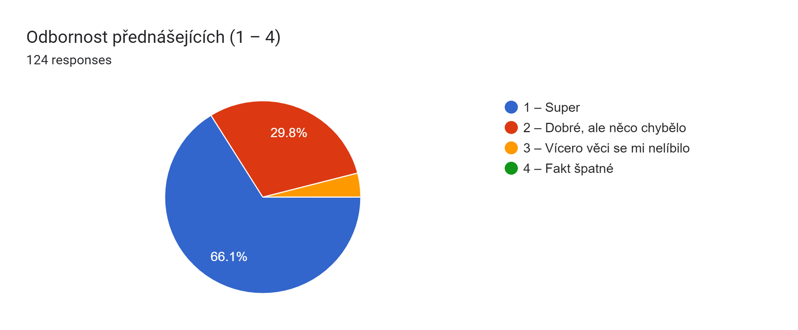
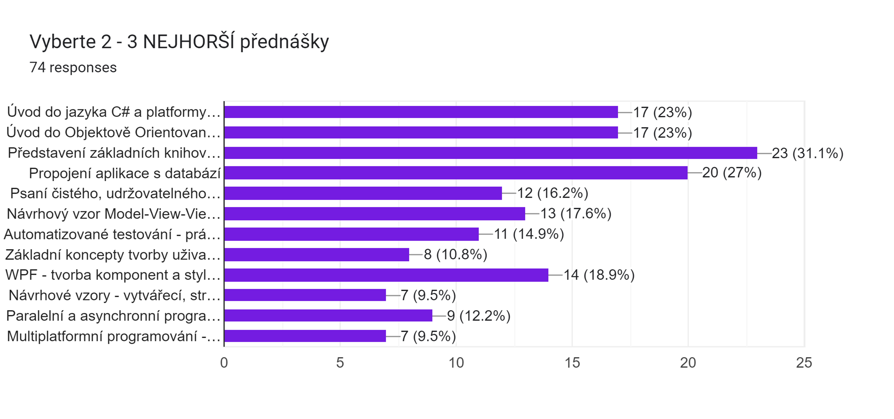
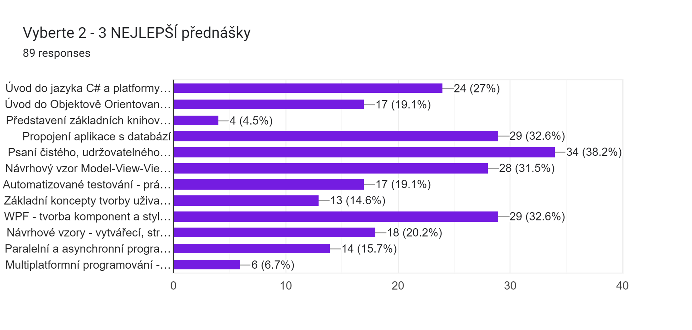
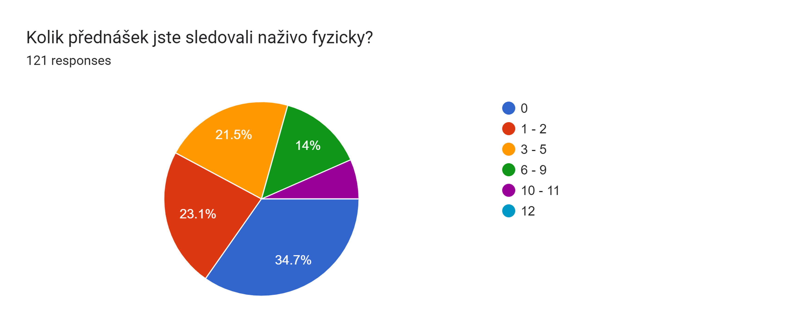
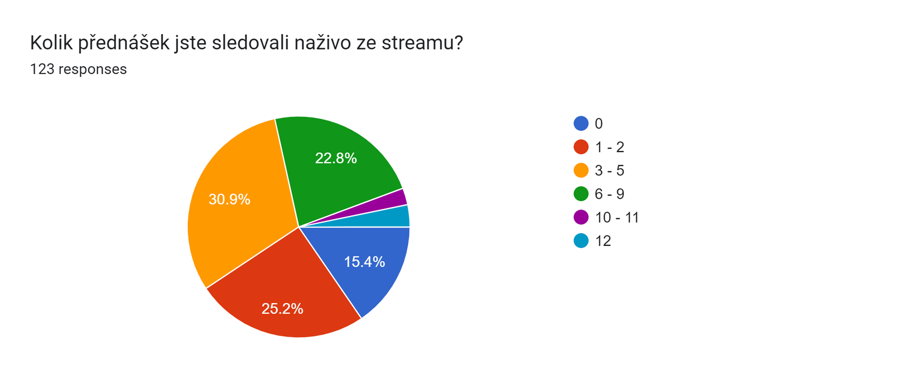

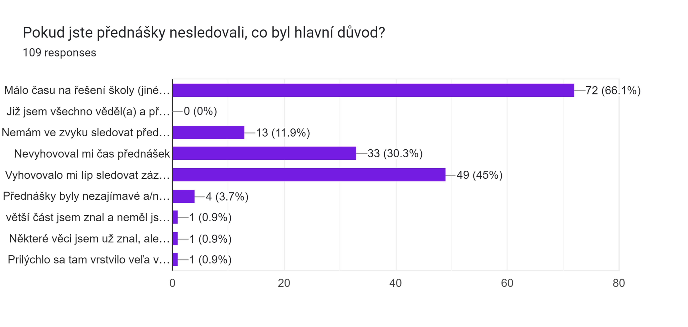
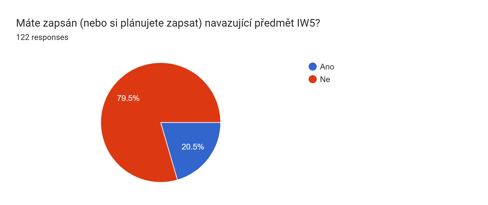

## Dobrovolná demonstrační cvičení
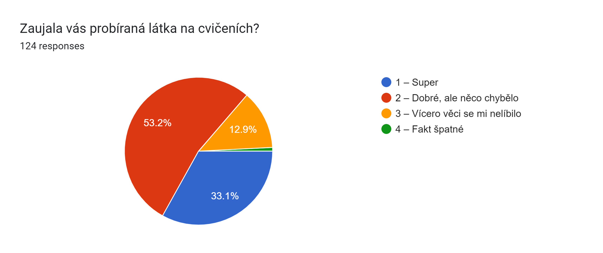
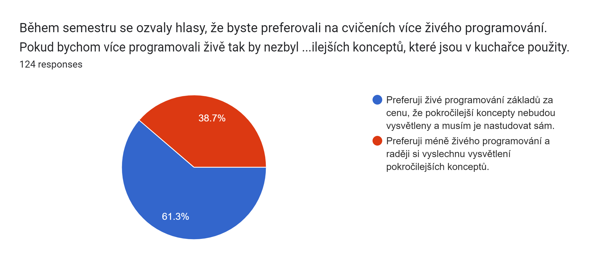
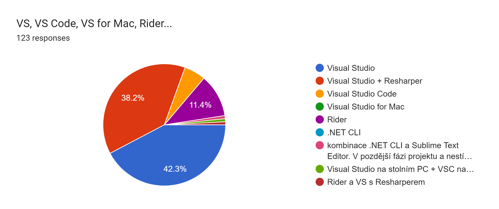

## Projekt
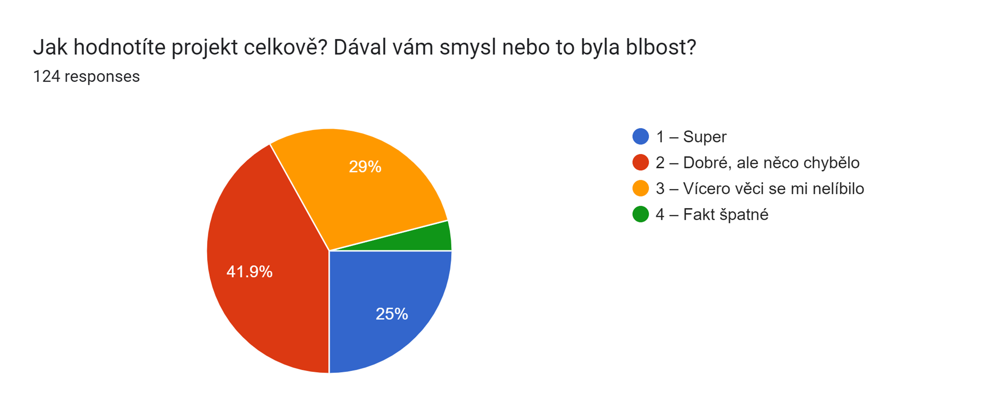
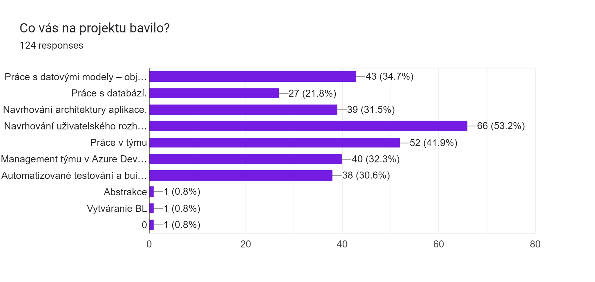
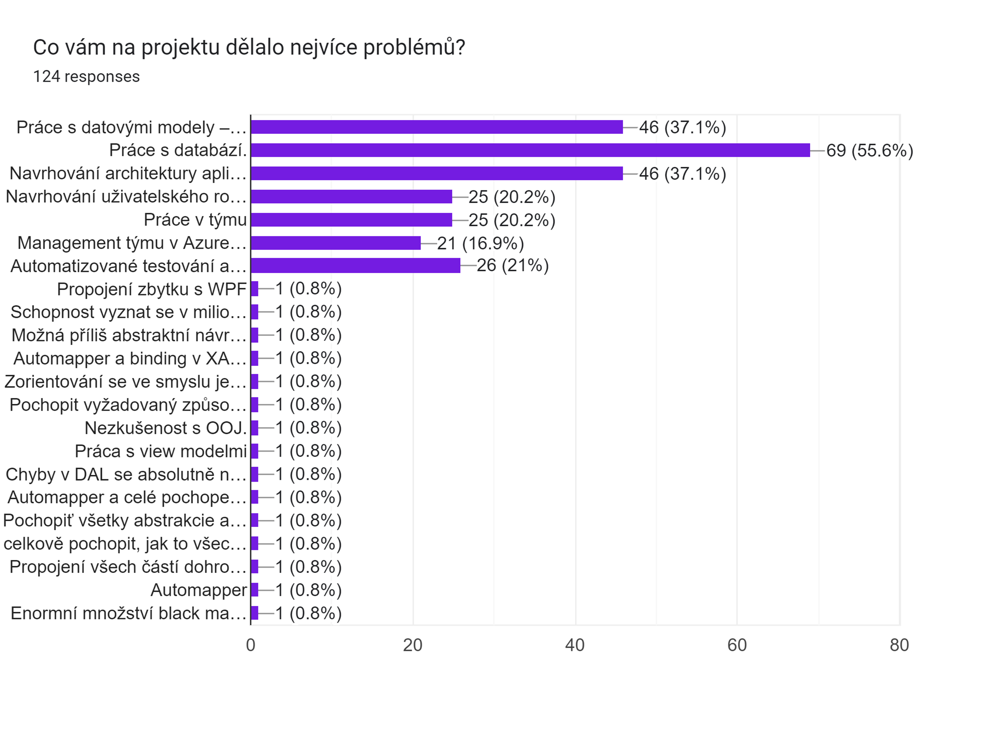

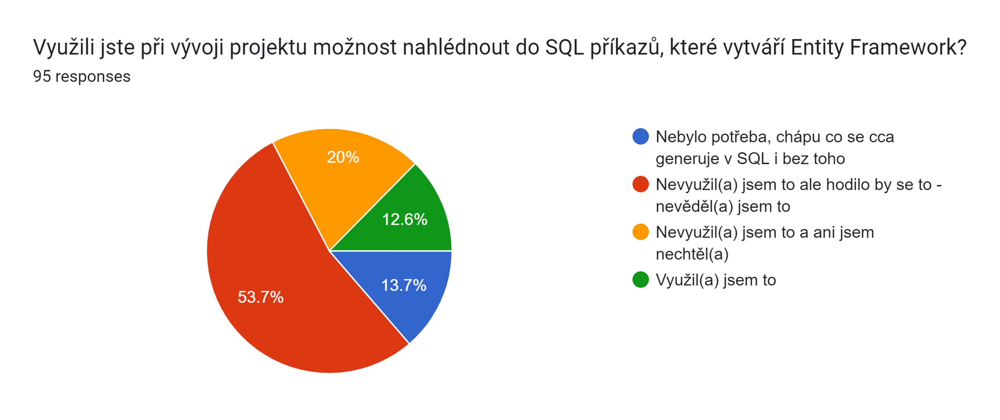

## Celkové hodnocení předmětu
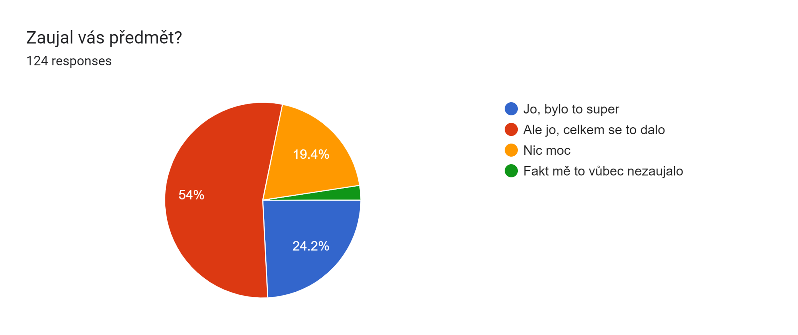

## Textové odpovědi
Poznámka: někteří respondenti si přáli abychom jejich odpovědi nezveřejňovali - jsou tady tedy jenom odpovědi lidí, kteří vybrali, že souhlasí s jejich zveřejněním.

### Nějaké další poznámky k přednáškám.
- Prednášky boli super, všetko mi prišlo kvalitne vysvetlené a nemám žiadne pripomienky :) Povedal by som že patrili medzi jedny z najviac prínosných z tohto semestru.
- "Kdyz se proklikava kodem a neco se vysvetluje, clovek se po dvou proklicich ztrati a vubec nevi, kde se nachazime(v jake vrstve, v jakem zanoreni, v jakem souboru...).  
Udelal bych to mozna tak, ze bych na druhe platno rozkreslil, co se chce, kam se zanoruje a proc.  
Abstrakce je super vec, ale pokud clovek vidi dany jazyk poprve, nikdy v nem nepsal, a hned se chteji abstrakce, strasne rychle se ztraci.  
Pokud by bylo vedle rozkresnely na nejakym diagramu, kde se nachazime, hodne by to za me pomohlo."
- Lépe uspořádat některé kapitoly (hlavně v prvních přednáškách). Např. dědičnost aby následovala až po definici třídy (nemusel to být přesně tento příklad, ale stejný princip).
- Příliš odborné, více vysvětlování pro hlupáky.
- Navrhoval bych zahrnout demo cvičení jako normální část předmětu. Bez nich bychom se ještě hůř orientovali v projektu.
- Živě byly přednášky ve velkém tempu a nestíhal jsem držet krok. Tak jsem se zpětně díval jen na ty, které jsem potřeboval. Zároveň přednáška/demo v pátek ráno na čtyři hodiny je po celý semestr docela overkill.
- Oddělila bych přednášky od cvik. Mít 4 hodiny prakticky v kuse je dost náročné.
- Látka nebyla příliš mířená pro začátečníky. Nebyly příliš ukázány krásy jazyka c# (např. linq).  Na předmět jsem se těšil a byl namotivovaný a velice mě zklamal. Příliš rychlým startem a pokročilými konstrukty mě k c# nenadchli. V úvodním předmětu do jazyka c#, který je za 4 kredity, by se rozhodně mělo snažit probrat všechno, ale měly by se probrat pořádně základy.
- Přednášky byly fajn, ale občas mi přišlo že některé těžko pochopitelné záležitosti byly příliš rychle probrané a málo ukázané v programu. V projektu bylo poté velmi časově náročné tyto změny zapracovat, ač byly ukázány v cookbooku, tak jsem je nedokázal aplikovat ve své apce.
- Pátek je fakt nejhorší čas, ale good job za streamy, chtělo by to více základů C#, víc rozvinutí celého EF Core, Automapperu jak funguji packages.
- Občas jsem měl pocit, že je látky mnoho a času málo. Základy C# byly rychle proběhnuté a kdybych neměl zkušenosti např. s generikami z jiných jazyků, tak bych doteď netušil, k čemu jsou.
- "Ako niekto, kto sa nevenoval OOP pred ICS, považujem prebratie tejto témy za príliš stručné, keďže je to niečo úplne nové (C# + OOP).  
Deň prednášky - piatok - mi nevyhovoval.   
Som rád, že som sa v tomto predmete zoznámil s Azure DevOps a prakticky si vyskúšal sprinty a postupný návrh aplikácie. Predmet mal obsahovo asi najbližšie k reálnej pracovnej skúsenosti, čo oceňujem. "
- Vseobecne dobre/zaujimave prednasy boli tie, ktore boli doplnene demo cvicenim, ktore s prednaskou suviselo.
- Těžko vybrat nejlepší a nejhorší přednášky, protože všechny, které jsem viděl měly ve srovnání s ostatními předměty na FITu skvělou úroveň, dobře se poslouchaly a byly plné informací. Velký palec nahoru za interaktivní slidy s code examples, ty bych rád viděl ve všech "programovacích" předmětech, jen rozjet je lokálně bylo mírně komplikované, ale možná to byl jen user error.
- "Přednášky byly velmi rychlé a řešili se nové a hodně abstraktní koncepty. Kolikrát mi až přišlo, jestli přednášející nepřišel přednášet navazující IW5. Pro někoho, kdo ani nemá žádnou zkušenost s OOP, byl ten hustý nekonečný příval informací zcela neústojný.  
Až na přednášku první, která byla naopak pomalá a zcela zbytečná, a to včetně následného cvičení. Myslím, že nikdo nepotřeboval vědět, co jsou to identifikátory, klíčová slova, bílé znaky, literály, operátory, rozdíl mezi hodnotovým a referenčním typem, že desetinná čísla mají omezenou přesnost, rozdíl mezi stack a heap nebo jak se používá for a while. Na stránce předmětu dokonce uvádíte prerekvizitu IZP, kde je všechno toto vyučováno. Zkrátka 90% první prednášky by se dalo shrnout do věty ""C# je postaven na C a prakticky vše co znáte z C zde funguje stejně."" A to je završeno cvičením s tutoriálem na instalaci VS. Nehledě na to, že VS nebo aspoň VS Code bude většina stundentů mít, nepředpokládám, že by se našel někdo, kdo by si ho nedovedl naistalovat vlastním umem.  
Ještě úvod do WPF mi přišel zbytečně podrobný ve srovnání se zbytkem učiva. Půlka dostupných kontrolek má vlastní slide v přednášce...   
Chápu, že to máte blbý, protože pojmout všechno za semestr rozhodně nejde, přednášet jen základy a čekat, že to složité se studenti doučí sami je blbost, ale zase přednášet jen to složité smysl taky nedává, protože pokud někdo přišel jen se znalostí programování z povinných předmětů, žádné základy nezná, aby mohl chápat cokoli pokročilého.  
Nevím, jestli máte nějaké osnovy na rozsah probraného učiva, ale opravdu bych doporučil celkový rozsah zkrátit, nebo minimálně zmenšit level abstrakce.   
Navazující cvičení mi přišla většinou zbytečná, protože z přednášky jsem sotva co zvládl hned pochopit, a u cvičení hned potom, zrychlená tím, že veškerý kód už je napsán a jen se komentuje, bylo prakticky nemožné se držet.   
A projekt byl třešnička na tomhle hořkém dortu. Týmy pro 5 lidí, aby nebylo ""málo"" problémů s komunikací, práce s Gitem, který může být pro někoho novinka, práce s databází, což byla pro asi pro většinu novinka, code-first, totéž, povinné testy, protože asi nemáme co s časem (chápu význam testů, ale je mnohem víc jiných příležitostí, nebo celé na ně orientované předměty, kde se jim věnuje prostor), první odevzdání, kde se tážeme sami sebe, k čemu nás je 5, když designujeme 3 entitní třídy. Musím říct, že výhoda týmové práce v tomto předmětu byla, že nebylo nutné se naučit všechno, což podle mě ani za 3 měsíce nebylo možné, vzhledem k dalším 6 povinným předmětům, kterým musíme věnovat čas, ale to je podle mě špatně.

Tak, to byla moje zpětná vazba, ale opovažte se ten předmět udělat lehčí. Jen ať se budoucí ročníky potrápí."
- "+ Aktivita při dotazech na dc   
    \+ stream při řešení druhé části projektu   
    \+ Celková ochota při jakémkoliv problému"
- Rozhodne by som okomentoval kód v CookBooku. Pre niekoho, kto to vidí prvý krát je tomu naozaj ťažké porozumieť. Nehodnotil by som tak prísne blbé chyby, ale hlavne funkčnosť.
- Učil by som základy jazyka, .net do hĺbky (nie len dve prednášky) a nie ent\*ty fr\*mework či wpf. Možno by som prípadne radšej šiel smerom webu (asp.net). 😡
- U přednášek k view modelům a ostatním WPF aspektům mi přišlo opravdu náročné se zorientovat, což ale může být dáno přímo náročností tématu.
- Hlavně v začátcích by bylo fajn trošku přeskládat pořadí, ve kterém jsou informace předávané. U některých přednášek mi přišlo, že látka, která měla zaznít úplně na začátku, zazněla až po hodině, a já jsem se v záplavě informací mezi tím ztratila (konkrétně třeba přednáška na úvod do oop). 
- Opravdu jsem nebyl schopen se dívat na úvodní části předmětu kde se jede jedna teorie za druhou, mě takováto věc nic nedá a pokud si dobře pamatuju tak jste taky říkali něco jako "nebojte bude to lepší" :) I bylo, jenom já bych to osobně úplně přeskočil.
- Celkovo k forme prednášiek asi výhrady nemám. Osobne si myslím že prednáška na clean code, aj keď to je podstatná téma, nie je podľa mňa potrebná v tomto predmete učiť. Zásady písania clean code sa už pred týmto predmetom spomínal asi v ďalších troch iných, a teda moc nového som sa z nej nedozvedel. Výčitku by som mal asi ešte k prednáška ktorá sa venovala bindingu. Keďže pre dosť ľudí bola toto prvá skúsenosť so C#, pomerne veľká časť projektu bola prinajmenšom inšpirovaná CookBookom, a na tejto prednáška mi chýbal detailnejší popis  priamo na kóde CookBooku a vysvetlenie ako v ňom komponenty medzi sebou komunikujú.
- Pustím si to co jsem zmeškal o prázdninách ve volných chvílích :D
- Neseděla mi hromada anglických pojmů na přednáškách, které sice vím že se používají, ale protože jsem neznal jejich přesný význam tak jsem si nemohl vytvářet správnou představu o funkčnosti a zpětně si pojmy dohledávat už není tak efektivní(co se týče pochopení tématu), zvlášť když je jich tolik.
- "Dle mého názoru byla abstrakce na přednáškách na příliš vysoké úrovni na to, aby se jednalo o první seznámení studentů s C#. Předmět bych asi raději rozdělil na více předmětů, kde v prvním by se člověk dozvěděl základy C#, jak co funguje a až poté by následoval tento předmět, s touto úrovní abstrakce.  
Rovněž bych v popisu předmětu více zdůraznil schopnost pracovat s databázemi, protože jako student který nebyl z FITu jsem se bohužel v této části hodně ztratil."
- Prednášky na ktorých som bol boli asi najlepšie tento semester a bolo mi lúto že som ich nevidel viac, ale keď som sa potom chcel dostať k slajdom pri príprave na pohovor mal som problém s formátom v ktorom boli na gite zverejnené. Commandy ktoré boli v návode mi vyhadzovali chyby a v rýchlosti som to nevedel dostať do čitatelného formátu. Keby sú niekde zverejnené ako pdf bol by som velmi rád.
- Styl přednášek byl jiný než v ostatních předmětech. Působily víc profesně než akademicky. Pro mě to byla příjemná změna a přednášky byly koukatelné. Jak moc se nám ale hodily u projektu je ale něco jiného. To rozvedu tedy až na části projektu, který byl celý špatně navržený.
- Vysvětlovat věci víc od základů, nepředpokládat že máme zkušenosti s OOP (které opravdu na FITu nemáme) a taky spousta dalších věcí, ze kterých se na přednáškách vycházelo jsem neměl moc tušení, o čem je řeč a hodně mě to brzdilo
- "Viac prakticky ukazovat, menej omačky  
Momentalne bolo myslim okolo 6 democvik, radsej by som mal 12 democvik a 6 prednasok"

### Co byste se rádi dozvěděli v navazujícím předmětu IW5?
- Nechci vyvíjet appky pro uživatele, takže si IW5 nezapisu.
- Základní principy toho, jak .Net pracuje uvnitř.
- Jak vytvořit lehčí webovou aplikaci v C#. A lehký základ Unity zní dobře.
- "- možnost procvičit základy i pokročilé vlastností C# (včetně např. async/await). 
    - Minimal Web API (od nejjednoduššího možného až po pokročilé). 
    - základy ASP.NET Core, Razor a Blazor (Blazor Server, Blazor WebAssembly, Blazor Hybrid). 
    - co všechno jde v C# dělat -- low-level optimalizace a interop (Span/Memory, unsafe, IntPtr, PInvoke, COM, C++/CLI). 
    - Unity, MonoGame a další možnosti pro game-dev a jiné 3D interaktivní aplikace. 
    - další .NET jazyky (hlavně F#) a jak je kombinovat. 
    - Roslyn, jak používat a vytvářet Analyzers a Source Generators. 
    - možná i něco o vývoji VS Extensions. 
    - práce s GitHubem, GitHub Actions, atd. 
    - základy Azure Cloud Services. 
    - OpenAPI, CoreWCF, SignalR, gRPC -- kdy a jak je použít v C# + jak funguje Service Reference vs VS. 
    - něco málo o PowerShellu"
- asp.net
- Tvorba server-client aplikace (ať už webové nebo desktop).
- Už raději nic.
- "jak psát webové aplikace přímo do prudukce  
něco málo o maui, v ICS se to jen nakouslo"
- Vytváření mobilních aplikací, komunikace mezi aplikacemi
- Jak tuto architekturu rozšířit do production ready verze, i v ohledu bezpečnosti - authentifikace
- Vnitřní funkčnost platformy .NET
- Těším se, až se naučím používat C# nejen pro windowsovské nebo desktopové aplikace. Také bych rád znovu dělal na nějakém praktickém projektu, naučil se jiný způsob propojování a komunikací s databází
- Nevím
- Blazor, ASP.NET Web APIs, minimal APIs, SignalR, Identity
- Měl jsem si ho v plánu zapsat, ICS mě však odradilo

### Co byste vylepšili/co se vám nelíbilo? (Sekce "Dobrovolná demonstrační cvičení")
- "Myslím, že democvika docela slušně pokryly to, co jsme měli na kuchařce chápat. Když to ale člověk vidí poprvé, má z toho hlavu jak balón a ani neví, co neví.  
Možná bych se tedy pokusil kuchařku osekat o abstrakci a více vysvětlit, jak co funguje (chápu, že je to krok zpět, ale třeba by to pomohlo k hlubšímu pochopení)."
- V prvom rade by asi bolo dobré zaradiť cvičenia priamo do časového harmonogramu (ak by to bolo možné). Úprimne ako začiatočník v programovaní v C# si nemyslím, že by bolo reálne napísať taký rozsiahly projekt bez nich a takto sa skresľuje celkový čas, ktorý by mal študent predmetu venovať. 
- Možná méně pokročilých konceptů v kuchařce. Nepřišlo mi, že jsem je ze cvičení pochopil a  zaškrtnul jsem možnost více živého programování, takže sám bych je nejspíš pochopil ještě míň.
- vysvětlení proč je dobré používat tu a onu abstrakci a jak poznat kdy ji máme použít
- Cvičení byla super, ale po dvou hodinách přednášky bylo těžké udržet pozornost (zvláště když se nejednalo o živé programování). Díky záznamům mi však nic nechybělo.
- "Myslím si, že ve cvičeních chybělo pořádné prozkoumání ""jak spolu které komponenty komunikují"", protože tohle si myslím, že byl pro spoustu lidí, hlavně v posledním odevzdaní, celkem pain. Mnoho generik, mnoho dědění, mnoho interfacu, všechno má svojí base classu, automagie tady automagie támhle.  
Ty automagie jsou často velký problém, není nic více frustrujícího, než když se na přednášce řekne ""tohle funguje automagicky"" a pak s tím člověk počítá, ale nefunguje to. Respektive to fungovalo jen někdy a nikdo nebyl schopný přijít na to kdy ano a kdy ne :D  
Příkladem je, že se nám samo nevolalo CanExecuteChanged, takže se nám neměnilo v UI ""disabled/enabled"" u buttonu. Což jsme vyřešili brute force řešením tak, že jsme do base modelu přidali Action, kterou jsme (když bylo třeba) nastavili na Command.NotifyCanExecuteChanged a nechali tuto action zavolat pokaždé v Set() metodě. Takže když se změnila jakákoliv hodnota tohoto modelu, tak se tato notify metoda zavolala."
- O niektorých konceptoch bolo na cvičeniach podaných málo informácií. Je možné, že sa preberali na prednáške, na ktorej som zrovna nebol.
- Nelíbí se mi VS, ale používal jsem ho
- Stejna odpoved jako u prednasek vyse....
- Prednášky boli veľakrát prednášane nevhodne pre ľudí, ktorý videli C# a všeobecne programovanie na takej abstraktnej úrovni, prvýkrat. Niekedy prístup skôr pôsobil ako prednes kolegom v práci namiesto študentom. 
- Príliš veľa abstraktnosti pre úplných začiatočníkov. Inak to bolo fajn :).
- Prospělo by snížit náročnost projektu, aby se cvičení dalo více rozvolnit. Klidně by mohla být nějaká cvičení v menších kruzích, kde bychom programovali sami za nějaké body. Ale chápu, že by to bylo personálně náročné a taky by se musel velmi přepracovat systém projektu.
- Měli by se více probírat základní aspekty C#. Opustit od pokročilých konstruktů
- Oddělila bych přednášky od cvik. Mít 4 hodiny prakticky v kuse je dost náročné.
- Více ukázat a pozastavit se nad základy tak, abychom danou problematiku opravdu pochopili.
- Nemít jen jednu aplikaci (cookbook) - ukázat aspoň dvě použití nějaké koncepce..
- "Souhlasím s potřebou více živého programování, ale to asi není možné v rámci předmětu stihnout časově. Líbí se mi nápad, co jsem zahlédl na Discordu, a to vytvoření doplňkových videí s případným podrobnějším vysvětlením CookBooku, přičemž by na cvičeních mohly být dál vysvětlovány pokročilejší koncepty. Kdo by následně potřeboval (a osobně za náš tým mohu říci, že by to hodně pomohlo) by se mohl podívat na doplňková videa. Chápu samozřejmě náročnost vytvoření takových videí, ale myslím, že by to studentům dost pomohlo i do budoucna.  
P. S. Jako příklad bych uvedl, že práce s AutoMappery je napoprvé dost zmatečná, na což bylo na přednášce řečeno něco ve smyslu ""samozřejmě nemusíte používat AutoMappery, můžete si mappingy napsat sami"", k čemuž by se ale hodil právě nějaký dodatečný příklad."
- Z môjho pohľadu boli cvičenia od začiatku "príliš abstraktné", myslím to z toho pohľadu, že som vôbec nebol zvyknutý na to, že predtým než môj program reálne niečo robil, som už musel mať vytvorených x filov s definíciami entít, ich atribútmi/metódami/previazaním z databázou/...Toto je možno viac problém toho, že som nemal žiadne skúsenosti z OOP pred týmto predmetom, preto to bolo pre mňa zo začiatku ťažko uchopiteĺné, no myslím si že som neni jediný, kto mal takýto problém.  Osobne by som ocenil, keby boli na začiatku ukázané nejaké "hmatateľné" veci, čo si človek vie aj sám odskúšať, napríklad ukladanie/vyťahovanie dát z databázy bez využitia AutoMapperu, vytvorenie nejakého "teaseru" ( najviac jednoduche GUI ake sa da (jedno okno, na ňom nejaky textbox, button...) , a pomocou toho ukázať približne ako sa bude robiť projekt (z textboxu sa po kliknutí vyberú dáta to enitity, tá sa uloží do databázy.... ) ). 
- Hodilo by se více vysvětlení *proč* je ukazovaný kód napsaný tak, jak je napsaný. Nestačí jej ukázat a říct: "takto je to správně"
- Iný deň ako piatok. Koncepty majú byť vysvetlené na prednáške, nie na cvičení.
- Najvacsi problem sme mali s 3. castou projektu. Hoci sme splnili poziadavky pri 2. odovzdani, tak az pri vytvarani UI sme zistili, kolko dalsich metod v ramci fasad nam chybalo. Vela z nich sme museli dopisat, co islo samozrejme uz rychlejsie, lebo sme vedeli ako na to, ale spatne mi pride celkom nezmyselne, ze sme pisali metody, ktore na oko splnali poziadavky minimalnej funkcionality ale pre UI boli v nepouzitelne.
- Rozhodně bych ocenil alespoň průlet různými chytáky a specifiky, na které se dá při vývoji narazit (hlavně s Entity Frameworkem, AutoMapperem). Věřím, že po letech práce s C# to má člověk zažíté, ale přechod z jiného jazyka a jiného ORM (Python, SQLAlchemy) bolel. CookBook byl v začátku poměrně "hození do vody" a ačkoliv jsem v průběhu vypracovávání projektu principy v kuchařce pochopil a docenil a dokázal je nějak přenést a aplikovat na problematiku projektu (což je předpokládám účel), tak počáteční "learning curve" byla dost strmá.
- Občas by mi více než ukázka na kuchařce pomohl nějaký naprosto triviální příklad, a pak případně předvedení na kuchařce (ta byla úžasný zdroj, přestože mi chvilku trvalo se v ní zorientovat). Tedy trochu kombinace obou přístupů - živé programování i ukázka existujícího kódu. Prvních pár democvičení bylo v totmo naprosto perfektních.
- Cvičení byly super, probraly se věci potřebné k projektu, byl prostor pro otázky 
- I když je Visual Studio dobrý nástroj, pro mě byl na poměrně výkonném počítači celkem nestabilní a pomalý, možná by byl opravdu Rider lepší alternativa, ale nejradši bych VS Code.
- Poznámka k prednáške ohľadne bindingu asi patrí sem, ale tak to čo bolo napísané k nej platí aj tu.
- Celkové množství kódu a abstrakce mi přišlo příliš náročné. Opravdu bych raději pořádně probral základy.
- Hodilo by sa možno podrobnejšie vysvetlenie prepojenia aplikácie s databázou  a BL keďže sa počas semestra zdalo že s tým malo dosť ľudí problém. Taktiež by možno bolo dobré pri týchto témach ukázať, aké chyby sa v projektoch najčastejšie vyskytujú.
- Skúsiť vysvetliť kód trochu viac od základov. Keďže väčšina z nás sme boli nováčikovia v C#, osobne mi prišlo, že to bolo veľmi veľa abstrakcie. Trvalo dlhšie všetko pochopiť. 
- Vytváření seedů do databáze nebylo úplně dobře vysvětleno na cvičeních, musel jsem zkoušet metodou pokus omyl. Hodilo by se říct, proč se ty jednotlivé věci seedují a uchovávají tak jak tomu je v Cookbooku (to, že seedy mají vliv na funkčnost automapperu a BL mi také dlouho trvalo zjistit). Také by se hodilo vysvětlit, co dělat při vzniku cascade delete cycles, hodně týmům se to objevilo a věřím, že někteří v tom mají i doteď trochu bordel.
- Více živého programování a méně ukazování již napsaného kódu.
- Zaměřil bych se mnohem více na to jak funguje automapper a vztah modelů k entitám. I po dokončení projektu nemám stále tušení jak mapování funguje - zejména tedy u vztahů m:n mezi entitami.
- Věnovat více času základům, bez kterých pokročilejší věci stejně nepochopím. A taktéž počítat s tím, že jsme se už s OOP setkali je na FITu bohužel mylné. A spousta dalších věcí, se kterými jsem se zatím nikde nesetkal a na přednášce/cvičení se počítalo s tím, že je znám. Například teď mě napadá seedování dat. Je to banalita, ale jelikož to nebylo vysvětleno co to je proč to je a k čemu to slouží, tak než jsem pochopil o co jde, tak jsem nestihl vnímat jak se to dělá atd... 

### Měli byste nějaký nápad na téma zadání pro budoucí ročníky?
- Napadá mě jednoduchá databáze pacientů v nemocnici - bylo by to hodně o filtrování, o konfliktech v objednávkách (pacient nemůže být ve stejný čas na více vyšetřeních), byla by tam různá oddělení, do kterých by spadali různí doktoři... Možná je to ale moc komplikované.
- Aplikace pro správu práce v týmu
- Niečo asi podobné ako "Seznam filmů a seriálů" - vytvoriť informačný systém na predaj vstupeniek do kina. Užívateľ sa môže prihlásiť, filtrovať filmy podľa žánru, času atď., objednávať vstupenky na konkrétny film ...
- "Jednoduchá aplikace pro správu sportovního týmu.  
Měla by ankety, události (trénink, turnaj), ""diskuzní fórum"" sloužící pro domluvu týmu"
- jako jednu ze zakázek pro souseda jsem dělal program pro správu tenisové školy. Měl možnost přidat/odebrat/upravit záznamy u žáků, měl přehled o trenérech, dále přehled o hrách v kterých mohl být omezený počet žáků a trenérů. Hry byly honocené podle tabulky. Každý žák mohl mít vlastní ocenění za hru a podle toho mu hra byla účtovaná. Aby nemusel zadávat dokola stejné hry, měl šablony, které si mohl vytvořit a pak v okně pro hry vkládat pro danný den, který chtěl. Další část bylo přehled vyúčtování pro každého žáka a odesílání emailem .... možné podrobnosti bych mohl při zájmu zadání specifikovat či úkázat
- Plánování drážní dopravy (odjezdy vlaků ze stanice, ... )
- Aplikácia pre poskytovanie ubytovacích služieb (Airbnb)
- Knihovna/databáze knih
- Appka na výmenný obchod
- Aplikace pro správu financí mezi spolubydlícími. Vložení nákupu, zjíštění kdo komu kolik dluží, vložení platby, Celkové statistiky kolik celkově dlužím, nebo kolik kdo dluží mě.
- "Lehká bankovní aplikace (přehled účtů, posílání peněz z účtu na účet, opakované platby, sdílené účty,...)  
Aplikace na rozvoz jídel (fake DameJidlo)  
Hudební přehrávač (dokázat rozdělit podle interpreta, alba, nebo umístění v zařízení, vytváření si vlastních playlistů apod.) - podobné galerii obrázků"
- "Bug Tracker;  
(možná se můžete inspirovat seznamem zadání pro IUS/IDS?)"
- Cestovná kancelária - výber pobytov, zajazdov
- Kalorické tabuľky
- Sportovní výsledkový servis s databází sportovců, turnajů, týmů (nejlépe kolektivní sport).
- Kalendář s plánováním událostí. Součastný projekt byl přínosný, jelikož byla ukázána práce s databází. V dalších rocích by byl vhodný podobný projekt, ale ve výrazně menším rozsahu. Nejlépe jako v předmětu IJA, zvolit projekt pro tříčlenné týmy. 
- autolakovňa
- food delivery:)
- "Autolakovňa  
    - užívateľ by mohol byť vlastníkom viacerých áut, 
    - bolo by možné vytvárať samozrejme nových užívateľov a vytvárať objednávky, 
    - po skončení práce na aute by sa mohol automaticky kontaktovať užívateľ predpripravenou správou, že má hotové auto, 
    - autá užívateľov by sa viedli v databáze aj s históriou návštev lakovne
    - (mohli by sa automaticky zasielať prípadné správy o zľavách alebo akciách)"
- Knižnica, videopožičovňa, simulácia väznice.... 
- Aplikace pro sklad s pivními sudy(zaměstnanci, příjem a výdej ze skladu, objednávky, ceník, historie objednávek, atd..)
- Správa Esport turnajů, Banka, pokud ho vyberete dostanu třeba bonus body do IW5?
- Food delivery
- Restaurace/obchod(supermarket, lekarna,...), servisní služby (autoservis,...)
- Pěkný nápad by byla seznamka, ať už pro romantické účely, nebo seznamka pro hledání kamarádů, myslím, že na tom by se dalo docela dobře vyžít a být kreativní. Nebo by mi přišla zajímavá aplikace pro sdílení pokroku na projektech s kamarády - mohli by se navzájem podívat, kolik procent mají hotových/kolik na něm strávili času, a podobně.
- Food delivery - něco jako naše appka pro spolujízdy, akorát by se tam objednávalo jídlo z různých restaurací 
- Quiz app (s kategoriami, pridavanim otazok/kategorii, upravou otazok/kategorii, nastavenim roznych modov testov napriklad dava otazky az kym sa clovek nepomyli a z toho score, dostane presne 15 otazok a na konci sa ukaze uspesnost v percentach a pod)
- Restaurace
- Jednochá aplikácia na objednávanie a dovoz jedla. Ako entity by mohli byť uživateľ, reštaurácia, jedlo a objednávka. Uživateľ by si mohol vyhľadať reštaurácie, prezrieť si ich ponúkané jedlá a následne vytvoriť objednávku. Ako rozšírenie by mohla byť feature na označenie si svojich obľúbených jedál a reštaurácií.
- Beer delivery
- E-shop / Knižnica
- Aplikaci pro evidenci společných nákupů pro spolubydlící. Např. Kdo co koupil, pro koho, kolik kdo komu dluží, možnost vytvářet platby atd...
- Bohužel asi nemám
- Aplikace na domlouvání piva po večerech v hospodě s lidmi s podobnými zájmy

### Co byste vylepšili/co se vám nelíbilo? (Sekce "Projekt")
- Jedna z vecí, ktorá podľa môjho názoru nebola dostatočne vysvetlená je prepínanie views vrámci hlavného okna (prípadne vytváranie nových okien). Keďže CookBook je statická aplikácia bez prepínania pohľadov trochu sme bojovali ako to vymyslieť v našom projekte. Nakoniec sme skončili s nie úplne najšťastnejším riešením - bool Visibility properties ktoré boli roztrúsené skoro v každom súbor viewModel a zaujímalo by ma či by neexistovalo lepšie riešenie.
- Mezi 2. a 3. odevzdáním bylo poměrně málo času. Přitom 3. odevzdání je suverénně nejtěžší - často jsme opravovali i třídy vytvořené během prvních dvou fází.
- "Myslím si, že by více než pomohl nějaký chart, kde jde vidět komunikace mezi soubory (klidně referenčně pro kuchařku). Zárověn by tam mělo být vidět rozdělění na DAL, BL a APP, protože tohle nám taky dělalo extrémní problém, hlavně ze začátku druhého odevzdaní.  
Možná by nebylo špatné, kdybyste uváděli i špatné příklady, člověk ""cca ví, proč se to takhle člení"", ale já mám živou zkušenost se špatným příkladem a byl jsem proto v týmu ten, který říkal ""hey vsak je to krasne, kdybyste videli ... "". Já už totiž v c# pracuju asi 3/4 roku na appce, jejíž backend dělal nějaký student z muni a mám krásné porovnání, proč je hezké navrhovat appku tak, jako jsme dělali. Stejně jsem si to u něj nedokázal obhájit a dostal jsem odpověd, že u takové appky je takové rozložení nesmyslné a stačí pouze repository + vm (VM prakticky slouží jako fasáda?). "
- Obecne nemám rád tímové projekty, pretože vo veľkej miere závisia na poriadnosti každého člena skupiny. Rozumiem, že projekt je príliš veľký pre jednotlivca, ale uvítal by som možnosť zvoliť si menší tím.
- Upravit data odevzdání jednotlivích částí. Poslední část by chtěla více času. Je to ta nejobsáhlejší část a trvalo nám, než jsme se začali orientovat, a proto byl víkend před odevzdáním opravdu výživný.
- "Velice jsem si v poslední době oblíbil návrhový vzor podobný tomuto. https://gunnarpeipman.com/ef-core-dbcontext-repository/  
Odbourá se tím celá vrstva repositories."
- "Zpetne si uvedomuji, ze se to rikalo nekolikrat, ale pokud budete zachovavat abstrakce a to i v cookbooku... Zduraznete poradne, ze v predeslych verzich to bylo rozdelany a napsany ""neabstraktne"" a ze si to maji studenti projit od nejake verze, aby pochopili, jake myslenky za tim stoji.  
Pokud budete zachovavat abstrakce, nejlepe udelejte minimalne jedno demo na to, ze to prave takto projdete a vysvetlite na tom, jak jsou nektere veci reseny, proc se pouzivaj modely tak jak se pouzivaji atd."
- Trochu zmírnit míru abstrakce. Rozdělení do tříd a do projektů v řešení jsou v pořádku, spíš jednotlivé části. Např. úplně abstraktní fasáda.
- uvítal bych víc příležitostí procvičit si základy C# a jednotlivé koncepty na jednoduchých programech před vytvářením velké aplikace se vším naráz (případně rozdělit velký týmový projekt do menších týmových/individuálních projektů?)
- Myslím si, že v rámci ics není potřeba, aby kuchařka, ze které jsme čerpali, byla tak složitá. V práci pracuji s C# a .Net a sám jsem měl s některými koncepty problém. Za mě by bylo lepší, kdyby se kuchařka zjednodušila a více se zaměřilo na funkcionalitu(složitější funkce fasád, větší funkcionalita v gui, atd). Nevyužíváme v práci například unitOfWork nebo factories. Například bez těchto části by podle mě studentům nedělalo takový problém to pochopit jako celek a odnesli by si z toho daleko více. Tyto koncepty by se poté mohly probírat například v navazujícím IW5. 
- Presnejšia špecifikácia zadania (viac menej vyriešené pridaním bodov na obhajobe)
- Myslím, že by neškodilo ubrat na náročnosti/rozsahu projektu. Náš tým podle mě věnoval tak 50% veškerého času tento semestr jen pro ICS (přednášky, demo, meetingy, programování, ...). Ten projekt je dost zajímavý, ale hodinová dotace pro něj velmi přesáhla moje očekávání. Taky by naše aplikace vypadala mnohem lépe a funkčněji, kdybychom měli prostě více času nebo byla méně komplexní. Bez CookBooku bychom byli naprosto nahraní.
- "V pětičlenném se nám mnohokrát stalo, že každý uměl jen a pouze tu svojí část. Projekt byl skoro celý až na UI a View Modely copy-paste, místo toho abychom byli nuceni aktivně vymýšlet řešení a tím se seznámit s frameworkem. Potom pro všechny působil projekt jako slátanina modulů, která tak nějak automagicky fungovala.  
Dobré by byly cca 3členné týmy, které by pracovali na menším projektu. Každý by si tak více osahal projekt a tím i pracoval v C#."
- Rozhodně udělat projekt výrazně jednodušší, nejlépe pro méně členů (tříčlenné týmy). Zbavit se především kopírování částí kódu z ukázkového projektu. První část byla příjemná. BL bylo naprosto příšerná část a poslední část byla lepší, ale bohužel nebyla, vhodná pro rozvržení práce mezi 5 lidí. Nelíbilo se mi také využívání LocalDB namísto nějaké sdílené databáze, takže se nám projekt špatně dokončoval.
- ráznejší prístup ku konzultáciam, skoršie uskutočnenie, nie napríklad o 5 dní  
- Více investovat do vysvětlení EF core + automapper. Pro mě osobně to bylo velice náročné na pochopení.
- V projektu je na můj vkus velké množství abstrakce, což v kombinaci s malým rozsahem projektu vede k ohromnému množství boilerplate kódu. To by ani samo o sobě nebylo až tak špatné, ale za mně je ten kód samotný nedostatečně vysvětlený. I když jsem z přednášek pochopil koncepty, nevěděl jsem, co dělá velká část kódu v projektu. To vedlo k slepému kopírování kódu z CookBooku, což je samozřejmě škoda, jelikož samotný projekt je zajímavý.
- Osobně preferuji jiné architektury než MVVM, ale jedná se o osobitý názor, který by asi neměl mít moc odrazu na předmětu 
- projekt ako celok sa mi páčil, látka bola dostatočne vysvetlená, možno mi chýbali trochu komentáre niektorých konštrukcií v CookBook-u, kde sa mi ťažšie hľadala inšpirácia na rôzne problémy spojené s vývojom aplikácie
- "Ten Automapper by som troska viac rozviedol v prednaskach/cviceniach. Popripade by som niekde zdoraznil ze existuje toto -> https://github.com/AutoMapper/AutoMapper/tree/master/src/UnitTests  
Dost nam to pomohlo pri zistovani, ako tie mapovania funguju."
- Odpověď k wireframu - Na začátku jsme si navrhli aplikaci, která byla velmi složitá na naprogramování, tak jsme ve výsledku snad použili jen navigační menu. 
- Možná ještě více rozdělit na nějaké mezidobrovolné odevzdání mezi 2 a 3 částí. Ten skok je tam hodně velký a času málo mi přijde tak, to možná celé posunout. Hlavně první část když je tam minimum programovnání. A je to v podstatě hlavně o přemýšlení nad ER a Wireframem.
- "Méně složitý CookBook PROSÍM. Většina z nás vidí C# poprvé a nemůže chápat dokonalost tohoto projektu. Věřím, že kdyby CookBook byl ~4x srozumitelnější / používal ~4x méně komplexních věcí (na úkor počtu class a SOLID principles), tak by studenti možná i vymýšleli vlastní návrhy / řešení, jak kód napsat lépe / čistěji / s méně code duplication. Nechte studenty také navrhovat. Prezentujete CookBook jako ultimátní a jediné možné řešení problému, ale my ještě nemáme profesní zkušenosti.  
Bojím se, že i přes všechny vaše snahy komunikace se studenty a těmito dotazníky, se vám omylem podařilo znechutit C# polovině ročníku."
- Tento projekt mal veľký potenciál, no nakoniec sa u mňa zaradil medzi najhoršie skúsenosti s projektami počas štúdia na FITe. Pre niekoho, kto nemal predošlé praktické skúsenosti s OOP a už vôbec nie C#, bol Cookbook nerozlúštiteľnou záhadou. Miera abstrakcie bola prepálená a po hodinách strávených nad kódom som mal stále problém pochopiť, čo sa v ňom vôbec deje. Programovanie bolo o to horšie - pripadal som si ako robot, ktorý len opisuje kód z Cookbooku (keďže som nedokázal pochopiť ako celá vec pracuje), až kým náhodou nezačne "fungovať" (zmiznú tie červené písmenká po spustení). Ak by som dopredu vedel, do čoho idem, tento predmet by som si určite nezapísal a považujem to za zázrak, že sa nám projekt vôbec podarilo dokončiť, keďže prepojenie WPF so zvyškom projektu nebolo zďaleka dostatočne vysvetlené. Pre niekoho s predošlými skúsenosťami je projekt možno hračka, ale pre nováčikov je to až odrádzajúce a demotivujúce pracovať s takým množstvom úplne nových konceptov.
- Tema nasho projektu mi prisla ako jedna z najlepsich co boli.
- "Zlozitost projektu - projekt by bol zaujimavejsi keby bolo na neho viac casu ale bohuzial pocas semestru je tych projektov uz dost a myslim ze bol pomerne zlozity pre ludi co sa so C# a celkovo OOP stretli prvykrat. Naucit sa pracovat s jednotlivymi frameworkmi bolo dost prinosne ale casova obtiaznost (asi zalezi ako moc sa ludia v time stretli s OOP) bola dost vysoka a tak velakrat to viedlo k tomu ze trebalo niektore veci urobit co najrychlejsie a bez rozmyslania.  
Mozno urobit nejake 'frequently asked questions?' - verim ze opakovane otazky na DC vedia byt celkom frustrujuce ale nie vzdy sa asi dostala aj ocakavana odpoved. Chapem ze ked niekto posle screenshot erroru a potom sa spyta ze 'preco to nefacha' tak sa bude asi tazko odpovedat. Preto by bolo podla mna uzitocne urobit nejake zhrnutie otazok alebo popripade mozno urobit aj nejake kratke videa vysvetlujuce vysvetlujuce dane problemy (ako napr. video navyse od Romana kde zbehol nejake nejasnosti k projektu boloo dost napomocne k pochopeniu nejasnosti)  
Inak dost sa mi pacilo pouzitie samotneho DevOpsu a moznosti odovzdavania cez repo a nemuseli sme riesit to ze dostaneme 0b ked zle pomenujeme odovzdavany archiv. Taktiez pouzitie pipelin, ktore pustali jednotlive unit testy si myslim ze bolo velke plus pre buduce vyuzitie . Koncept celeho projektu bol super a verim ze by bol uzitocny keby sme mali na neho viac casu pocas semestru."
- Vypustil bych 1 nějakou složitou/náročnou povinnou vlastnost (MVVM, databázi, testy, ...) (viz komentář k přednáškám)
- Nezadával by som projekt vo WPF, ani ent\*ty fr\*mework (či celkovo grafickú app), ale radšej niečo, čo by súviselo čisto s naučením jazyka ako takého (prípadne aj niečo z .net) - konzolovú aplikaciu. Nedá sa povedať, že by mi projekt, ktorý spočíva len v kopírovaní CookBook niečo dal (bez toho, aby som vôbec niečomu rozumel), práve naopak, z predmetu nemám nič a o C Sharpe viem toľko, koľko som vedel predtým. :)))) 😡
- Celkově styl projektu se mi moc nelíbil. Pro někoho, kdo v životě neviděl C#, tak projekt měl až moc abstraktních věcí a celkově složitých částí. Na přednáškách nám říkali, že to máme kopírovat z cookbooku a až v 10. (cca) přenášce jeste řekli, že to můžeme mít podle sebe. V tu chvíli jsme chtěli celou aplikaci zahodit a napsat si ji odznova podle sebe, ale na to už bohužel nebyl čas.
- Cookbook
- Možná by bylo příjemné zmínit v rámci přednášek důležitost plánování práce (vzhledem ke všem ostatním školním povinnostem a tomu, že projekt je na celý semestr), nebo tipy jak si ji v týmu dobře rozdělit.
- Za mě osobně mi projekt přišel spíše o práci s entity frameworkem a databází, než s C# samotným, což mi mírně vadilo. Sice je EF zajímavý, a určitě i užitečný, ale asi bych ho úplně nedávala do projektu v předmětu, který by měl, aspoň dle karty předmětu v systému, naučit základy jazyka, s čímž podle mě většina i počítala a předmět si proto volila. Osobně nevím, jak bych byla schopna projekt dělat, kdybych neměla základy C# z dřívějších let, popřípadě neměla jako jiný OOP i Javu, protože mi nepřijde, že bych si na nějaké větší základy OOP v projektu sáhla.
- Rozhodně bych úplně změnil postup projektu. Za mě osobně to byl nejnudnější projekt na bakaláři a ve výsledku jsem nic nepochopil, dokonce mi to i znechutilo C#. Nutno podotknout, že jsem viděl všechny přednášky a cvičení, měl jsem C# na střední dokonce jsme v C# dělali IVS projekt. Všichni, se kterými jsem se bavil, neměli tušení, co dělají, jenom kopírovali CookBook. Já i přes mé předchozí zkušenosti také naprosto netušil, co dělám a jak to mam dělat. Navrhoval bych tedy zjednodušení projektu za cenu toho, že to nebude doslova copy-paste. Přece jenom to je pro většinu lidí první setkání s C# a kopírováním se nic nenaučí. Koukal jsem na loňský projekt na GitHubu a ten mi přišel mnohem smysluplnější a ten kód jsem i chápal. Tady ne. 
- Více času na 3. odevzdání, popř. to standardně nechat až na zkouškové období
- wireframe sa pri implementácii menil podľa toho, co sa jednoduchšie implementuje
- Asi lepšie špecifikovať že u druhého odovzdania sa očakáva funkcionalita Facades a že vlastne celá business logika sa viac menej odohráva v daných Facades.
- Vadila mi velká míra abstrakce. Všechny koncepty sice byli probrány na přednáškách, ale (podle mě) v příliš krátkém časovém úseku na pochopení a hlavně implementaci. Samotná vzorová aplikace (kuchařka) se tvořila hodně dlouhou dobu a nějak mi nedošlo to, že my máme napsat podobnou (v jistých směrech i malinko složitější) vlastní aplikaci za tak krátkou dobu. Samotný projekt bych tedy zjednodušil. Je pravda, že jsme si projekt mohli implementovat kompletně podle sebe, ale přeci jen vzorová kuchařka byla asi jeden z nejdůležitějších zdrojů informací. Osobně bych tedy preferoval lepší vysvětlení funkčnosti do hlouby a menší míru abstrakce v projektu na úkor znovupoužitelnosti kódu. Přijde mi lepší napsat aplikaci, která není "perfektní", ale je v ní kód co se opravdu využije, než psát aplikaci která je abstraktní, snadno rozšiřitelná a splňuje všechny přednášené koncepty, ale reálně by se dala udělat mnohem snáze a velká část kódu je tam jenom "co kdybych náhodou chtěl...".
- Pomocný CookBook bol pre mňa ako úplného začiatočníka veľmi náročný na pochopenie a i napriek dokončeniu projektu som mnoho veciam nerozumel 
- V letošním projektu chyběla navigace mezi okny, mohlo by se to někomu hodit
- "Dlho sme nechápali, že fasády môžu mať aj nejaké prepisovateľné metódy. Bolo by vhodné v kuchárske pridať aspoň jednu metódu, ktorá by ukazovala ako sa má overridovat nejaká metóda a že je tu tá možnosť. Zrušil by som bodové hodnotenie počas projektu, je to strašná demotivácia, pretože nie je možné urobiť na prvý krát dokonalú bl vrstvu, keď si nie sme vedomí všetkých problémov, ktoré môžu nastať v gui. Keby som znova robil podobný projekt, už by som mal predstavu.  
Nechápali sme nastavenie Entity Frameworku. Poznám prístup rôznych PHP frameworkov, kde je takáto práca s entitami jednoduchá. Tu mi to prišlo veľmi náročné a nechápal som ako spraviť zložitejšie queries, najmä keby som potreboval pristúpiť napr. k User.Cars[0].Rides[0].Passengers. Je možné, že by bolo lepšie využiť nejaký lazy load, alebo písať manuálne sql. To by bolo možno vhodnejšie aj na previazanie učiva s IDSkom. Zvyšok mojich spolupracovníkov ani nechápali aky problém entity Framework rieši. Použitie automapperu je podľa mňa v poriadku, ale manuálne písanie kódu by bolo možno rozumnejšie, pretože by ľudia zasa získali znalosť, prečo je lepšia abstrakcia. Zhnuste im písanie dlhých omáčok kódu a budú používať automapper. Zhnuste im automatické tooly, lebo im nerozumejú a nemajú motiváciu ich používať a budú použiť dlhé špagety kódy. "
- Snížení úrovně abstrakce
- Osobne mi prišla práca na projekte príliš overwhelming, hlavne kvôli tomu, že sú hneď zo začiatku vyžadované design patterny, keď ešte človek nieje úplne zoznámený s jazykom (a pre mnohých je ICS aj prvý experience s OOP overall). Osobne by som preferoval jeden menší projekt na zoznámenie so C# a dotnet ekosystémom a potom druhý projekt v terajšom formáte.
- "Změnil bych myšlenku projektu a kuchařky. Tenhle předmět mě nenaučil jazyk C#, ale připravil mě na práci ve firmě s .NET platformou. Neměli jsme příležitosti psát vlastní kód, ale jenom jsme přepisovali existující kód. Kvůli tomu bylo velmi těžké zjistit, jak vlastně části aplikace fungují. Otázka je tedy co je cílem projektu a předmětu.  
Pokud to má připravit studenta na práci v IT firmě, pak to bylo poměrně splněno. Byl totiž takový simulátor toho být juniorem ve firmě. Pak by bylo ale lepší více pomáhat studentům s pochopením.   
Pokud měl studenta naučit programovat v .NET platformě, pak alespoň u našeho týmu cíl předmětů velmi selhal."
- Nikdy jsem nedělal C#, OOP, návrhové vzory a další pokročilé věci. A tady hned na začátku mám tvořit celou strukturu a architekturu aplikace a tvořit a propojovat databázi... za pomocí docela pokročilých věcí. Samozřejmě to pak je zbastlené, barely funkční, spíše vůbec.
- "Preferoval by som pristup kde by sme museli viacero veci programovat from sratch  
Samozrejme som ovela menej kvalifikovaný ako Vy, ale myslim ze by sa usetrilo vela litrov prepotenej krvy, ak by sme mali programovat veci od nuly (samozrejme koncept CookBooku je super ale fakt ze z desiatok ak.nie stoviek suborov sme programovali tak realne 1/5 viedol k tomu, ze sme vela veciam pochopili dost neskoro - mozno zaviest v ramci cviceni nejaky mini coding testik kde si musia ziaci vyskusat znalosti daneho konceptu (fasada, repository,...) )  
Samozrejme ak by sme chceli kodit od nuly tak zadanie by muselo byt pravdepodobne zjednodusene co nevuem ci je mozne"

### Co byste na předmětu změnili/vylepšili?
- "Psal jsem to i do minulé zpětné vazby, ale jsem opravdu rád, že když jsme měli problém, vždycky nám někdo z doktorandů pomohl a posunuli jsme se.  
Děkujeme všem aktivním z ICS, co pomáhali na Discordu."
- Možná zmenšit abstrakci a využití větší abstrakce mít jako bonusové řešení.
- Udělat to možná  méně složitě, rozumím že v praxi se takto pracuje, ale pro nás to bylo hodně abstraktní a člověk, který přišel ze 3 semestrů cčka do objektového světa, ve kterém je ještě databáze, tak se dost ztrácel.
- Bylo by fajn, kdybychom si již v průběhu semestru zkusili implementaci nějaké opravdu mini-aplikace (nebo třeba zlomku projektu) s podobnou architekturou, která by nám pomohla pochopit teorii z přednášek a pak bychom více věděli kam projekt a všechny jeho části směřují. Jinak díky za super přístup vyučujících (odpovídání na dotazy, konzulatce o přestávkách, spíše neformální přístup, stream od Romana J. ...). Ten byl absolutně "top".
- "Popsala bych, že předmět naučí více než jen základy OOP v C# (viz cíl v kartě předmětu) :D.  
Někdy toho bylo už opravdu dost nového, ale všechno se nějak zvládlo :)"
- možná některá témata přesunout mezi ICS a IW5?
- Rozumiem, že tak obsiahle učivo sa nedá len tak napratať do 12 prednášok, ale bolo hard to keep up s takým kvantom nových informácií. Práca s azure robila veľký problém, dokonca si dovolim tvrdiť, že zistiť ako sa to obsluhuje, bolo tažšie ako tvoriť kód.
- Nakoniec aj keď sme hundrali bol toto celkom dosť prínosný predmet. Viac mi priblížil OOP a prácu s databázou. Azure bol veľký pain, možno by som s tým budúci rok študentov nezaťažovala, inak asi nemám žiadne pripomienky.
- čas přednášek mohl být v "optimálnější dobu" ale chápu, že je náročné kombinovat s rozvrhy více ročníků
- Trochu zvolnit :D, rozsah předmětu by někteří vyučující dokázali vměstnat i do dvou semestrů si myslím. Potom to je trochu na úkor naučení se něčeho nového, když se člověk jen bezhlavě žene za deadline projektu a nemá šanci stíhat i přednášky/dema.
- "Projekt byl příliš náročný v kombinaci se zbytkem studia. Projekt spíše působil tak, že měl být právě v navazujícím předmětu. Sice umím použít mediátor a fasády, ale základní bloky C# (na které jsem myslel, že je tento předmět zaměřený) jsou pro mě stále nejistoty. Více bych docenil kdyby se předmět uchýlil směrem opravdových základů (např. IJA, ISJ).  
Cením ale jasné zapálení přednášejících a jejich ochotu pomáhat. Zapálení na mě rozhodně působilo a poctivě jsem sledoval přednášky (dokud teda nazačal crunch před zkouškovým). "
- Za mě by bylo fajn, kdyby dělal projekt každý individuálně a mohl pochopit všechny části projektu.
- Důležité věci psát mailem a to jasně (neschovávat odkaz na anketu v odkazu na dotazník)
- Změnšit rozsah projektu. Nepoužívat ukázkový projekt, ze kterého z velké části jenom kopíruje a všechno funguje nějak "automagicky".
- Už jsem psal dříve, více času na codefirst DB..
- Samotného se mě to naštěstí netýkalo, podle velké části lidí, se kterýma jsem se bavil, ale byl projekt příliš komplexní (kombinace EF Core, Automapperu a MVVM, kde někteří nechápali, kde jaké částí začínají a končí a jak spolupracují, a místo toho jen bezhlavě kopírovali Cookbook a pak se kód snažili všemožně upravit podle zadání)
- Myslím, že dodatečná videa s popisem CookBooku by vyřešily většinu problémů, co s předmětem mám. Mimo to můžu pochválit snad vše ostatní - organizaci, komunikaci (hlavně na Discordu), i zajímavé přednášky.
- Predmet ako taký ma dosť zaujal a v konečnom dôsledku aj celkom bavil. No väčšinu času som mal pocit, že som si asi zabudol zapísať nejaký c# predmet, čo je prerekvizita ICS.
- Discord je urcite dobra platforma na komunikaciu, ale asi by to chcelo vytvorit privatny ICS channel len pre studentov. Popripade nejakym sposobom bojovat proti tomu, aby sa studenti radsej pytali otazky ohladom ICS v inych channeloch.
- CookBook doplnit o poznámky, vím že bylo vysvětleno něco na přednáškách ale když pak v chcete v rychlosti něco pochopit co si z ni nepamatujete tak to jde horko těžko. Přidat více základů k OOP, EF Core, Automapperu a migracím. Ještě jsem pozoroval v jiných roomkach že někteří nedostávali maily od vás, ale nevim proč to nechtěli řešit. A určitě dodržovat souběžné informace na na discordu mailu a githubu :) jinak je v tom hrozný bordel. Díky moc za váš přístup.
- trochu bych redukoval elitismus vyučujících. rady typu "a zkusil sis to vygooglit" sice problém eventuelně řeší, ale moc nepřidávají na sanitě a motivaci studentů
- "Abstrakciu projektu, vraj bola minulé roky na nižšej úrovni, tak by som ju určite vrátil, aj napriek tomu, že by sa muselo toho kódu písať viac.  
Odovzdanie projektu nastaviť na presný deadline, rovnaký pre všetkých a známy od začiatku semestra (príp. od zadania projektu), nie 24h pred obhajobou. "
- Viac demo cviceni ^_^
- Asi bych přeskočil nebo trochu osekal přednášky, které nejsou úplně nutné k projektu a na klíčová témata (např. propojení s databází, základy C#) bych vyhradil více času, protože věřím tomu, že zde jsou lidé, kteří C# nikdy předtím neviděli a třeba i já, který C# trochu znal, jsem se po 2. přednášce začal ztrácet.
- "CookBook by se hodil přístupnější pro začátečníky, třeba otagováním ""validních"" starých revizí, které nejsou ještě zrefaktorované do této architektury a tak širokého použití generik, případně vysvětlující komentáře, aby bylo lépe vidět z čeho prakticky toto zjednodušení vzniklo. Jak jsem již zmínil, nakonec vše ""docvaklo"", ale bylo to ze začátku náročné.  
Entity Framework a jeho principy asi neovlivníte, ale bylo by super se příští rok podělit s problémy letošních kolegů, zmínit specifika a rozdíly oproti jiným ""velkým"" ORM systémům, na co si dát pozor, co často zlobí a kudy kam hledat chybu (třeba i poukázat na konkrétní nástroje v rámci VS, Resharperu, Rideru, ...).  
Jinak díky, váš přístup k výuce, komunikace a chuť se zlepšovat je fakt na 10/10 a mnozí starší garanti, vyučující a povinné předměty se od vás mají dost co učit. "
- "Prekvizity - myslim ze prekvizita IZP je celkom nizka, nakolko ludia po IZP vedia akurat vytvorit nejake basic cykly a mozno alokovat nejaku strukturu :D. Taktiez by som mozno aj trocha ulahcil projekt uz len kvoli tomu ze ludia by sa aj chceli naucit zaklady C# ale casovo pocas celeho semestru to bolo celkom zlozite ked projekt hned skocil do pomerne vysokej abstrakcie a clovek nemusel ani poriadne dovtedy pobrat zakladne koncepty C# (samozrejme ze na prednaske to bolo vysvetlene aj chapatelne ale bez nejakej zakladnej praktickej aplikacie sa to potom neriesi tak jednoducho)  
Pevne deadliny - myslim ze by mal byt pevny deadline pre vsetkych, verim ze rozdelenie obhajob na viacero dni s moznostou dokoncenia projektu neskor bolo myslene pozitivne ale myslim ze to sposobilo akurat chaos."
- viz komentář o přednáškách
- Za mě byl ICS nejlepší předmět na FITu, ještě uvidíme co IW5 ale rozhodně jsem si z ICS vzal zatím nejvíce.
- Napln prednášok a projektu viac smerom ku základom. Dal preč ((ent\*ty fr\*mework)), wpf. :')))) 😡
- Projekt 
- Vylepšení mě nenapadají, chci ještě znova pochválit využití Azure DevOps, a obecně využívání nástrojů, které se běžně používají v praxi a mají k dispozici kvalitní dokumentaci.
- Stream naviac bol super napad, mozno by bolo dobre vysvetlit projekt uplne na nejakej najzakladnejsej vrstve ako ho spravit "skaredo" a od toho by sa studenti mohli vediet lepsie odrazit idk ci by to fungovalo
- Menší projekt a menší týmy, často lidé měli problémy s týmem a tento projekt se přes ostatní
- Méně rozsáhlý projekt
- Týmové cvičenia kde by sa dalo konzulovať problémy priamo s týmom.
- "Naivně jsem doufal, že se konečně naučím programovat v C# a .NET Core, ale místo toho jsem se jenom snažil pochopit všechny možné abstraktní koncepty, které mi moc nedáváli smysl. Raději bych probral méně věcí do hloubky, než hodně věcí povrchově. Jenom se prosím nesnažte probírat hodně věcí do hloubky, protože to opravdu nikdy nefunguje. Možná že kdybych měl zapsán za semestr pouze tento předmět a nic jiného, tak bych se toho naučil více a opravdu to všechno pochopil a vyzkoušel si to, ale se vším ostatním je to (alespoň pro mě) nereálné.  
Co se týče organizace předmětu, tak zde si asi nemůžu stěžovat. Možná až na termíny odevzdání finální části projektu. Nepřijde mi moc rozumné dát termíny obhajob 2 týdny od sebe a konec odevzdání projektu 24h před obhajobou. To znamená že jeden tým na projektu může pracovat o dva týdny déle? To přeci nedává smysl. Co ale musím dodat je, že po domluvě se několik termínu přesunulo na pozdější datum a za takový přístup rozhodně palec nahoru. Komunikace a řešení problémů přes Discord bylo taky super."
- "Mám zmiešané pocity z tohto predmetu. V prvom rade mi neskutočne zvýšil náročnosť projektu tím, kde boli aktívni 2-3 členovia.  
Prednášky som videl niekoľkokrát, sú zaujímavé a prinosne v určitých smeroch, avšak som i napriek tomu nedokázal získané znalosti preniesť do implementácii projektu a vyžadovalo to množstvo samoštúdia, na ktorý bohužiaľ nebolo vôbec čas a v závere som nakoniec poriadne nevedel ani čo som robil.  
Spätná väzba k projektu bola v prvých 2 fázach veľmi heslovitá (na štýl “načo vám je tohle?” a s ničím nám nepomohla v ďalšej fázy.  
Osobne mi nevyhovuje práca v takom “veľkom” tíme. Chcete nás tym pripraviť na budúcnosť, kde sa bude pracovať najmä v tímoch, avšak mám v mojom štúdiu nešťastie a problém si nájsť tím, ktorého členovia sa venujú naplno danému projektu a neťahajú celý projekt len 2-3 členovia z 5, čím stratím akúkoľvek motiváciu, čo ma veľmi mrzí a mení konečný pohľad na to. Preto mi viac vyhovuje práca v menšom počte ľudí v tíme.  
Aj napriek neaktivnemu tímu, ktorý spôsobil nechuť k tomuto predmetu, najmä projektu som motivovaný sa počas leta daným prebratý látkam venovať a zdokonaliť a následne zapísať IW5 predmet, avšak počas štúdia toho bolo príliš veľa popri iných predmetoch."
- Väčší ohľad na rozdelenie bodov v týme a možnosť opravy chýb z predošlých fáz odovzdávania 
- Méně náročný projekt
- Podle mého názoru by bylo skvělým kompromisem udělat místo živého programování, několik předtočených videí jako studijní oporu, kde by se vysvětlili úplné základy plus by se postupně psal kód s vysvětlením funkcionality. Přece jen základy nejsou složité a otázky zodpoví kolegové na DC a bude tím pádem lehčí prezentovat složitější koncepty v democvičeních. Napřídklad jak se v první democvičením psala kuchařka úplně od začátku. Nějaké nástavby na implementaci DAL, BL, atd. (nějaký kod, který by si student stáhl a implementoval sám za pomoci videa, či komentáře v kodu), aby student nebyl vázaný na funkčnost kódu týmu, jelikož se může stát, že je špatný tým, nebo prostě jen jim trvá jejich část udělat dlouho tak aby si to prve vyzkoušel na něčem o čem ví, že by mělo fungovat a pak nabité znalosti využít v projektu. Dá se argumentovat, že tento účel již nabývá cookbook, ale ten je již dodělaný, tím pádem je těžké se v něm pro neznalého student a orientovat a navíc by to bylo více interaktivní.
- Super předmět, časově náročný, ale jsem rád, že jsem si ho zapsal.
- "Předmět bych hodně osekal aby mohla být snížena úroveň abstrakce.  
Více  bych v popisu předmětu zdůraznil nutnost ovládání práce s databází, jelikož na tomto jsem se zasekl až téměř do finálního odevzdání a projekt jsem dokončil jen díky pomoci týmu."
- Projekt
- Projekt
- Predmet prekvapi zavislotou na prednaskach, co na Fite nie je bezne, celkovo sa vymyka klasickemu fitackemu predmetu, co je asi aj dobre :)
